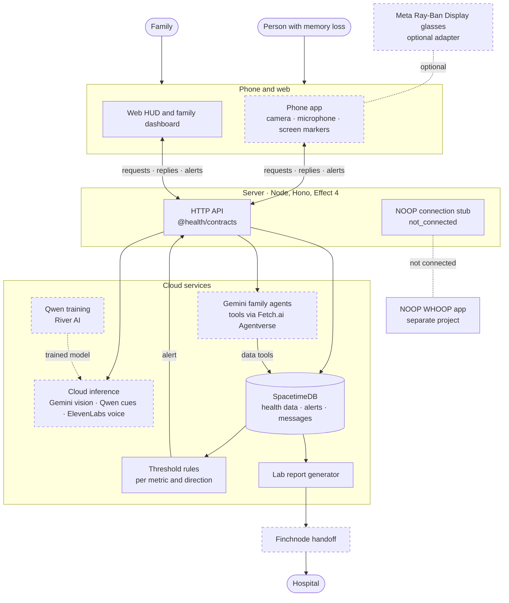

<div align="center">

# Telly

**A care assistant for a person with memory loss and their family.**<br>
Alzheimer's care first. Phone and web first. Glasses optional.

[Approved plan](docs/board.html) · [Plan summary](docs/plan.md) · [Coordination board](https://github.com/ayaangazali/telly/issues/53) · [Issues](https://github.com/ayaangazali/telly/issues) · [Contributing](CONTRIBUTING.md)

</div>

> [!IMPORTANT]
> Telly is in early development. The server API and the web screens exist, and they are tested only with local stand-ins and synthetic data. No live provider call is verified, the phone app is still a scaffold, and no hosted instance exists.
> Telly is not a medical device and makes no medical safety claims.

## Overview

Telly helps a person with memory loss through the day and keeps their family informed. "Telly" is the repository name; the product name is not decided yet.

The approved plan defines these features:

- **Medicine:** find a medicine box in a phone or browser camera frame, and mark it on the screen.
- **Requests:** accept voice or text requests, and reply with screen text and multilingual audio.
- **Family:** send family messages and health alerts, and answer family questions about available health records.
- **Reports:** generate, review, and send a lab report to the hospital.
- **Monitoring:** detect falls and breathing problems only from validated signals. Show a missing signal as "unavailable", never as "all clear".

Every feature works on the phone and on the web. Meta Ray-Ban Display glasses are an optional adapter. They never gate startup or a feature.

The source of truth is the approved planning board, [`docs/board.html`](docs/board.html). Download it and open it in a browser. [`docs/plan.md`](docs/plan.md) is a short text summary.

## Status

| Area | State |
| --- | --- |
| Bun workspace: web app, phone app, server, shared packages | Ready |
| Shared API contracts (Effect Schema, `@health/contracts`) | Ready |
| Server endpoints `GET /health` and `GET /api/sources` | Ready |
| CI: lint, types, tests, Fallow, Sentrux, server build and runtime smoke | Runs on Namespace runners ([runs](https://github.com/ayaangazali/telly/actions/workflows/health.yml)) |
| NOOP-to-server connection | Stub only. Reports `not_connected`, with no transport, readings, or nudges |
| Database (SpacetimeDB) and generated server bindings | Module, bindings, and server connection are ready and tested on a local database |
| Web app: HUD, medicine finder, family phone, family dashboard, family chat, care contacts, lab reports, and settings | The screens call the real server routes. Tested in a browser against a local server, a local database, a local test sign-in issuer, and a local stand-in for Gemini ([#11](https://github.com/ayaangazali/telly/issues/11), [#14](https://github.com/ayaangazali/telly/issues/14)) |
| Sign-in and family data API | OIDC token check and family access on every `/api` route except `/api/sources`. The web app has a sign-in screen (authorization code with PKCE). Tested with a local test issuer only. The production issuer is not chosen, and the phone app has no sign-in screen ([#4](https://github.com/ayaangazali/telly/issues/4)) |
| Phone app | Scaffold only: one screen shows `GET /api/sources`. No product feature exists on the phone yet |
| Threshold alerts and durable delivery | Rules, alerts, outbox, and acknowledgement routes are ready and tested on a local database. The web HUD shows the family's alerts. No family delivery transport exists yet, so deliveries show `unavailable` ([#5](https://github.com/ayaangazali/telly/issues/5)) |
| Family contact ladder: care needs, contact order, and accepted responsibility | The database runs each step on its own timer and records each attempt once. Calls are simulated, and messages stay in the app: no phone or SMS provider exists. Tested on a local database ([#30](https://github.com/ayaangazali/telly/issues/30)) |
| Lab reports | Generate, fill, and review, on the server and on the web reports screen. Hospital submission is unavailable: Finchnode only reads records ([#17](https://github.com/ayaangazali/telly/issues/17), [#8](https://github.com/ayaangazali/telly/issues/8)) |
| Finchnode laboratory results | Tested against the keyless public demo with fictional patients. The web app labels these results as demo data. No sandbox or live key is configured |
| Gemini medicine detection | The route, frame mapping, and errors are tested against a local protocol server. The web medicine screen draws the box and the arrow on the camera frame. No live Gemini call is verified yet ([#15](https://github.com/ayaangazali/telly/issues/15)) |
| Fetch.ai agent tools: server caller, bridge and worker uAgents (`agents/fetch/`), the signed-in route `POST /api/families/:familyId/tools`, and Agent Chat Protocol chat on the worker (synthetic records only) | Tested end to end on a local database with local agents and a local test sign-in issuer. The worker is published on Agentverse as `telly-fetch` (`agent1qvz4qf64ulzrvgrr0hd7mqrsr3y5t7rgnz6yp2qdrc6jkru2e8mz7x3dql6`). A live ASI:One round trip is verified for a synthetic demo family; the agent answers only while its worker runs ([#170](https://github.com/ayaangazali/telly/issues/170)) |
| Qwen health cues (server only): `POST /api/families/:familyId/cues` and the River training, data, and serving code (`training/qwen/`) | The route is tested on a local database against a local protocol server. A `Qwen/Qwen3.5-9B` LoRA is trained on River (version `health-cue-qwen35-9b-v1-2026-10-04`), and the server adapter gets valid cues from it through `training/qwen/serve.py`. River has no approved dedicated deployment for this base model yet, and no hosted instance runs the bridge ([#10](https://github.com/ayaangazali/telly/issues/10), [#9](https://github.com/ayaangazali/telly/issues/9)) |
| Family questions: Gemini chat with Fetch.ai tools, `POST /api/families/:familyId/ask` and `/ask/voice`, with follow-ups and attached files | Tested on the real server with a local database and local Gemini, ElevenLabs, and bridge servers. No live Gemini or ElevenLabs call is verified yet ([#86](https://github.com/ayaangazali/telly/issues/86), [docs/ask.md](docs/ask.md)) |
| Voice: ElevenLabs transcription and speech (`/voice/transcriptions`, `/voice/speech`) | Routes and errors are tested against a local protocol server. No live ElevenLabs call is verified yet, and the web HUD shows voice as unavailable without a key ([#16](https://github.com/ayaangazali/telly/issues/16), [docs/voice.md](docs/voice.md)) |
| Deployment | Planned. No hosted instance exists |
| Optional glasses adapter | Planned |

Each planned item has a [GitHub issue](https://github.com/ayaangazali/telly/issues). The pinned [coordination board](https://github.com/ayaangazali/telly/issues/53) shows who works on what. The build order is in the [plan summary](docs/plan.md#build-order).

## Quick start

You need:

- [Bun](https://bun.sh) 1.4.2 (the version in `package.json`)
- Node.js 24, for the server build and the smoke test
- Expo Go on a phone, or an iOS or Android simulator, for the phone app
- [Sentrux](https://github.com/sentrux/sentrux), only for `bun run check:structure`
- The [SpacetimeDB CLI](https://spacetimedb.com/install) 2.10.2, only for `bun run db:generate`, `bun run db:test`, and `bun run db:drill`

Run from the repository root:

```bash
bun install
bun run dev
```

| App | Address |
| --- | --- |
| Web app (opens the HUD; the other screens are in the taskbar) | <http://localhost:3001> |
| Server | <http://localhost:3000> (`GET /health`, `GET /api/sources`, and the signed-in `/api` routes below) |
| Phone app | Open it in Expo Go |

To start one app only, use `bun run dev:web`, `bun run dev:server`, or `bun run dev:native`.

On a physical phone, set `EXPO_PUBLIC_SERVER_URL` in `apps/native/.env` to the LAN address of your computer, for example `http://192.168.1.20:3000`. Then start the server with `HOST=0.0.0.0`.

The web sign-in screen needs `VITE_OIDC_ISSUER` and `VITE_OIDC_CLIENT_ID` in `apps/web/.env`. Without them, the screen says that sign-in is not set up, and the signed-in screens cannot load family data.

Each app keeps its environment schema in `.env.schema`. Varlock generates `src/env.ts` during `bun install`. After you change a schema, run `bun run env:generate`. Keep secrets in ignored env files, never in Git.

### Server API

All signed-in routes need `Authorization: Bearer <OIDC token>`. Set `OIDC_ISSUER`, `OIDC_AUDIENCE`, `SPACETIMEDB_URI`, and `SPACETIMEDB_DATABASE` in `apps/server/.env` (all four, or none). The database must trust the same issuer. Without them, these routes answer `503 unavailable`. Every error body is the `ApiError` contract.

| Route | Result |
| --- | --- |
| `GET /api/me` | The verified caller: issuer, subject, and database identity |
| `GET /api/families`, `POST /api/families` | The caller's families; create a family with the caller as its first member |
| `GET /api/families/:familyId` | That family's samples, alerts, messages, and acknowledgements |
| `POST /api/families/:familyId/members` | Add a person by their database identity |
| `POST /api/families/:familyId/samples` | Record a health sample; the database sets the receive time |
| `GET /api/families/:familyId/alerts` | Alerts, newest first, each with its source sample, delivery state, and acknowledgements |
| `POST /api/families/:familyId/alerts/:alertId/acknowledgements` | Acknowledge an alert as the caller; repeating it returns the same acknowledgement |
| `GET`, `PUT /api/families/:familyId/alert-thresholds` | List the alert rules; set one rule per metric and direction |
| `DELETE /api/families/:familyId/alert-thresholds/:thresholdId` | Remove a rule |
| `GET /api/families/:familyId/monitoring` | Each rule's state from the newest validated sample: `in_range`, `out_of_range`, or `unavailable` (`missing` or `stale`) |
| `POST /api/families/:familyId/vision/medicine-detections` | Find medicine containers in one camera frame with Gemini. See below |
| `GET /api/families/:familyId/reports`, `POST …/reports` | The family's lab reports, newest first; generate a draft from the family's latest samples |
| `GET …/reports/:reportId`, `POST …/reports/:reportId/fields` | One report; fill its fields while it is a draft (`409 conflict` after review) |
| `POST …/reports/:reportId/review` | A member confirms the report; it no longer changes. This is not clinician review |
| `POST …/reports/:reportId/submit` | `409` before review, then `503 unavailable`: Finchnode has no API that sends a report to a hospital ([#8](https://github.com/ayaangazali/telly/issues/8)) |
| `POST …/finchnode/sessions`, `POST …/finchnode/sessions/:sessionId/link` | Start Finchnode Connect for labs; link the patient to the family after they approve sharing |
| `GET …/finchnode/labs` | Laboratory results of the family's linked patients, with source, units, ranges, and consent state |
| `GET /api/families/:familyId/messages?after=<id>` | Family messages after `after`, oldest first, at most 200 |
| `POST /api/families/:familyId/messages` | Send `{ clientId, body }`; a resend with the same `clientId` returns the stored message ([docs/chat.md](docs/chat.md)) |
| `POST /api/families/:familyId/ask`, `POST …/ask/voice` | Ask a question about the family's records, as text with optional attached files or as a recording. Gemini answers with Fetch.ai data tools ([docs/ask.md](docs/ask.md)) |
| `POST /api/families/:familyId/voice/transcriptions`, `POST …/voice/speech` | Turn a recording into text, or text into speech, with ElevenLabs ([docs/voice.md](docs/voice.md)) |
| `POST /api/families/:familyId/tools` | Run one family data tool. The Fetch.ai worker is the caller |
| `POST /api/families/:familyId/cues` | A Qwen health cue from validated samples. Advice only: it never changes thresholds or alerts |
| `GET`, `PUT /api/families/:familyId/care/ladder` | Read or set the family's contact order |
| `GET`, `POST …/care/needs`, `GET …/care/needs/:needId` | List care needs, raise one, or read one with its contact attempts |
| `POST …/care/needs/:needId/responses` | The current contact sends `seen`, `answer`, `accept`, or `decline`; the member who accepted sends `help_confirmed` |

A caller who is not a member of the family gets `403 forbidden`. The database decides membership from the caller's token, never from the request.

When the database records a validated sample, it checks the family's rules in the same transaction. A fresh sample in the rule's unit that is strictly beyond the limit writes the alert and its queued delivery together. A replayed sample (same rule, source, and source time) raises nothing new. A stale sample raises nothing, and monitoring shows it as `unavailable`, never in range. No model takes part in this check.

The alert outbox sends each delivery at least once, with the idempotency key `alert-<alertId>`. It runs as the identity that published the module: set `ALERT_OPERATOR_TOKEN` to that identity's SpacetimeDB token. Without it, deliveries stay `queued`. Without a delivery transport, they become `unavailable`, never `sent`. Delivery (`queued`, `sent`, `failed`, `unavailable`) and family acknowledgement are separate.

Finchnode is off until `FINCHNODE_MODE` is set: `demo` uses the keyless public demo (fictional patients only), and `api` uses `FINCHNODE_API_KEY`. A report marker without a sample stays `null` (unavailable). Reports carry no reference ranges or flags, because no validated laboratory range exists for these signals.

#### Medicine detection

The body is `MedicineDetectionRequest` from `@health/contracts/vision`: the frame (`id`, `capturedAt`, `width`, `height`, `crop`, `rotation`) and one base64 JPEG or PNG image of at most 4 MiB. The client crops `crop` from the camera frame, rotates it clockwise by `rotation` degrees, and may scale it. The server checks the image bytes, type, and aspect ratio against that provenance. The reply is `MedicineDetections`: the same frame, with each box in camera-frame pixels. Draw a marker only on the frame with that `id`.

Set `GEMINI_API_KEY` in `apps/server/.env`. Without it, the route answers `503 unavailable`. `GEMINI_BASE_URL` changes the API origin, for example to a gateway. The server calls the Gemini Interactions API with `store: false` and a 20-second limit. It stops the call when the client disconnects. A provider failure is `502 upstream_error`, without provider text.

`needsVerification` is `true` when the model could not read the label or its confidence is below 0.7. The user must then check the label. A found box does not confirm a dose was taken.

## Checks

```bash
bun run lint              # Biome, no writes
bun run check-types       # TypeScript in every package
bun run test              # Behavior tests
bun run check:quality     # Fallow: unused code, duplication, complexity, import boundaries
bun run check:structure   # Sentrux rules and regression gate
bun run --filter server build && bun run smoke   # Real server responses under Node
bun run db:test           # Family-access, alert, outbox, report, Finchnode, connection-recovery, and server-lifecycle tests on an isolated in-memory local SpacetimeDB
bun run db:drill          # Crash-restart and backup/restore drill on isolated local data
bun run build             # Production build of every app
```

`bun run check` runs Biome and writes fixes. After you change `spacetimedb/`, run `bun run db:generate` and commit `packages/db/` with it; never edit `packages/db/src` by hand. CI fails when the bindings are stale.

CI runs these checks in [`.github/workflows/health.yml`](.github/workflows/health.yml). The one required status is `health / required`.

<details>
<summary><strong>Namespace runners</strong></summary>

<br>

The `check` and `structure` jobs run on the runner that the repository variable `HEALTH_RUNNER` names. The current value is `nscloud-ubuntu-24.04-amd64-2x4` (Linux AMD64, Ubuntu 24.04, 2 vCPU, 4 GB). When the variable is unset, the jobs run on `ubuntu-latest`.

`changes` and `required` always run on `ubuntu-latest`, so `health / required` reports even when no Namespace runner is available.

- Linux AMD64 with Ubuntu 24.04 is necessary: the Sentrux release is an x86-64 binary, and its fallback installs `libgtk-3-0t64`, which exists only on Ubuntu 24.04.
- If a job runs out of memory, set the variable to `nscloud-ubuntu-24.04-amd64-4x8`.
- To return to GitHub-hosted runners, delete the variable: `gh variable delete HEALTH_RUNNER -R ayaangazali/telly`.

The setup record is in [#21](https://github.com/ayaangazali/telly/issues/21).

</details>

<details>
<summary><strong>Database limits, backup, and restore</strong></summary>

<br>

The server bounds every database call:

| Operation | Timeout | Retries | On failure |
| --- | --- | --- | --- |
| Open a connection (`openFamilyDb`) | 5 s per attempt; sign-in caps the whole open at 10 s | 2, after 250 ms and 500 ms | `DbUnavailable`; sign-in answers `503 unavailable` |
| Reducer call (`callReducer(db, (c) => c.reducers.x(...))`, built on `callDb`) | 5 s; fails at once when the connection drops | none: a reducer call is not idempotent | `DbUnavailable` (`503 unavailable`), or `DbRejected`, which becomes `403` or `400` |
| Read cached rows (`readFamilyRecords`) | none (local) | none | throws `DbUnavailable` (`503 unavailable`) when the connection has closed |
| Shutdown (`SIGTERM`) | 3 s grace for requests in flight | none | then the server closes their sockets, which aborts each request and closes its database connection |
| Alert outbox step (operator connection) | 5 s per database step; 20 s per send; 30 s claim lease | at most 5 send attempts, after 5, 10, 20, and 40 s; the connection reopens every 5 s | a dropped connection ends the loop at once, and the worker reopens it; deliveries wait in the database |

Each request opens its own connection and closes it when the request ends or is cancelled. A dropped connection is not reopened in place: the cached rows count as stale, and the next request opens a new connection. An outage is always an `unavailable` error, never an empty result. With a token, the SDK first fetches a short-lived token over HTTP. The SDK patch in `patches/` aborts that fetch when the connection closes, so a cancelled or timed-out open releases it too.

Queues and retention: each alert has one delivery row in the database, so the outbox queue lives in the database and survives a server crash, a dropped connection, and a database crash (all three are tested). The worker handles at most 4 due deliveries at a time and polls every second. No retention limit exists yet: alerts, deliveries, and samples stay until a retention policy is chosen.

**Back up.** SpacetimeDB 2.10.2 has no online backup command, so take a cold backup:

1. Stop the database process (`SIGTERM`).
2. Archive the whole data directory (`--data-dir`, by default `~/.local/share/spacetime/data`): `tar -czf backup.tar.gz -C <data-dir> .`
3. Archive the identity-signing key pair with it: the files that `--jwt-priv-key-path` and `--jwt-pub-key-path` name, by default `~/.config/spacetime/id_ecdsa` and `id_ecdsa.pub`. Without them, the restored rows are intact, but no existing identity token is accepted. Keep this archive as secret as the keys.
4. Start the database again.

**Restore.** Restore into a new, empty directory, never over the live one:

1. `mkdir <new-dir> && tar -xzf backup.tar.gz -C <new-dir>`
2. `spacetime start --data-dir <new-dir> --jwt-priv-key-path <key> --jwt-pub-key-path <key>.pub --listen-addr 127.0.0.1:<port>`
3. Open a connection with a known token and compare its rows with the expected values before you send traffic to it.

`bun run db:drill` runs these steps with synthetic records, including two alerts whose deliveries are still `queued`, in temporary directories with its own key pair and CLI config. It also kills the database with `SIGKILL`, restarts it, and checks that every committed row and delivery state is present. `DRILL_PORT` picks its ports (default 3600 and 3601); it stops if a port already answers. It fails unless the restored rows equal the written rows.

</details>

## Architecture

This diagram follows the system diagram in the [approved plan](docs/board.html). Solid boxes exist in code and are tested locally. Dashed boxes are planned, or have no verified live connection yet.



| Part | Technology |
| --- | --- |
| Web HUD and family dashboard | React, Vite, TanStack Router |
| Phone app | Expo (React Native) |
| Server | Node, Hono for HTTP, Effect 4 for service logic |
| Contracts | Effect Schema in `@health/contracts` |
| Data | SpacetimeDB (TypeScript module in `spacetimedb/`, generated bindings in `@health/db`) |
| Providers (see [Status](#status) for what is verified) | Gemini vision and family chat, ElevenLabs voice, Fetch.ai Agentverse tool routing, Finchnode lab results, Qwen (`Qwen/Qwen3.5-9B`) on River AI |

```text
apps/
  web/          Web HUD and family dashboard
  native/       Phone app
  server/       Server; src/integrations/noop.ts is the NOOP stub
packages/
  contracts/    Shared Effect Schema API contracts
  config/       Shared strict TypeScript configuration
  ui/           shadcn/ui components for the web app
  db/           Generated SpacetimeDB bindings, server-only (bun run db:generate)
spacetimedb/    SpacetimeDB module: family-scoped tables, reducers, and views
agents/fetch/   Python uAgents bridge and worker for Fetch.ai Agentverse (outside the Bun workspace)
training/       Qwen training on River AI (training/qwen/README.md)
docs/           Approved planning board, plan summary, and API notes (chat, ask, voice)
noop/           NOOP, a separate project
```

Clients import only `@health/contracts`, and the web app also imports `@health/ui`. Only the server can import database code. Fallow and Sentrux enforce these rules in CI.

## Contributing

Work is issue-first:

1. Find or open an issue with the "Health task" template.
2. Claim it in a comment before you edit, and post progress there.
3. Open a pull request that refers to the issue with `Refs #N`.

Read [`CONTRIBUTING.md`](CONTRIBUTING.md) for the full rules. Use the [coordination board](https://github.com/ayaangazali/telly/issues/53) for short claim and handoff notes. Area owners are in the [plan summary](docs/plan.md#owners).

## NOOP

[`noop/`](noop) holds NOOP, an existing WHOOP companion app. It is a separate project with its own license and contributor rules; see [`noop/README.md`](noop/README.md). Telly does not import or build NOOP source code.
