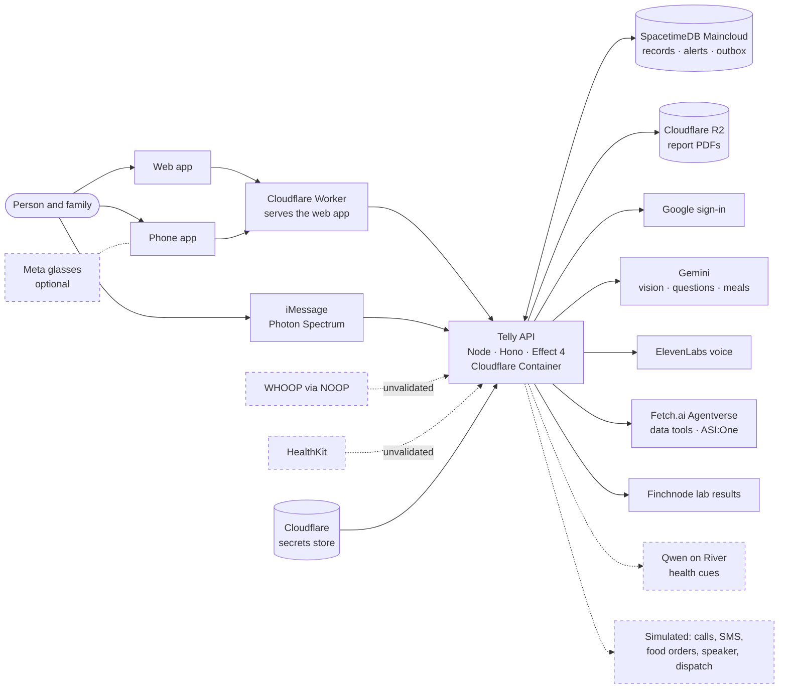

<div align="center">

# Telly

**A care assistant for a person with memory loss and their family.**<br>
Alzheimer's care first. Phone and web first. Glasses optional.

[Live app](https://telly.jerry-2c0.workers.dev) · [Approved plan](docs/board.html) · [Plan summary](docs/plan.md) · [Coordination board](https://github.com/ayaangazali/telly/issues/53) · [Contributing](CONTRIBUTING.md)

</div>

> [!IMPORTANT]
> Telly is a hackathon project. It uses synthetic demo data, and some outside actions are simulated (see [Status](#status)).
> Telly is not a medical device and makes no medical safety claims.

## What Telly does

| For the person | For the family |
| --- | --- |
| Ask by voice or text, and hear the answer in their language | See alerts, acknowledge them, and follow a contact ladder until someone accepts |
| Find a medicine box in the camera frame, and remember where it was last seen | Ask questions about the person's records; answers cite their source and age |
| Medication, meal, drink, and bedtime reminders that can be snoozed or declined | Keep a care profile with verified instructions and per-person sharing |
| Guided exercise, trip check-ins, and "Help me get home" | Review lab reports, correct values, and save private PDFs |
| An urgent-help route and a fall check-in | Plan appointments and share updates with a clinician after consent |

Missing data always shows as "unavailable", never as "all clear". No model decides whether an alert fires. Every feature works on the phone and the web; Meta Ray-Ban Display glasses are an optional adapter.

## Architecture

Solid lines are live. Dashed boxes are simulated or not connected on the deployed app.



## Providers

Each section says how Telly uses the provider, where the code and keys are, and what proves it works. Key names are in `apps/server/.env.schema`; values live in the shared Cloudflare secrets store ([docs/cloudflare-keys.md](docs/cloudflare-keys.md)), never in Git.

<details>
<summary><strong>Gemini</strong> · medicine detection, family questions, meal photos</summary>

- **Use:** finds medicine boxes in one camera frame (`POST …/vision/medicine-detections`), answers family questions with Fetch.ai data tools (`POST …/ask`), and estimates meals from a photo (`…/meals`). Calls use `store: false`. Vision has 30 s: `gemini-3.8-flash` gets the first 12 s, and when it answers 429 or 503 or is slower, `gemini-3.5-flash` gets the rest. Questions try `gemini-3.5-flash` at once, then both models again after 1 s and 3 s, within 45 s per question ([docs/ask.md](docs/ask.md#provider)).
- **Code:** `apps/server/src/integrations/gemini.ts`, `gemini-chat.ts`, `gemini-meal.ts`. **Key:** `GEMINI_API_KEY`.
- **Proof:** live medicine detection answered 200 ([#174](https://github.com/ayaangazali/telly/pull/174)). Live Gemini checks for calm support, meal photos, and medicine memory are in [#180](https://github.com/ayaangazali/telly/pull/180). A request with the stored key returned 200 ([#126](https://github.com/ayaangazali/telly/pull/126)).
- **Limits:** the key is on the free tier, with 20 requests a day per model. When both models are out of quota or overloaded, a question says "The assistant is busy right now", and a picture check says "The picture checker is busy right now". A found box does not confirm that a dose was taken.

</details>

<details>
<summary><strong>ElevenLabs</strong> · speech to text and text to speech</summary>

- **Use:** transcribes voice requests (`scribe_v2`) and speaks answers in the request's language (`eleven_flash_v2_5`). Routes: `…/voice/transcriptions`, `…/voice/speech`, `…/ask/voice`.
- **Code:** `apps/server/src/integrations/elevenlabs.ts`, [docs/voice.md](docs/voice.md). **Keys:** `ELEVENLABS_API_KEY`, `ELEVENLABS_VOICE_ID`.
- **Proof:** live speech returned audio ([#174](https://github.com/ayaangazali/telly/pull/174)); the stored key returned 200 ([#126](https://github.com/ayaangazali/telly/pull/126)); live voice answers in [#180](https://github.com/ayaangazali/telly/pull/180).
- **Limits:** no real-device microphone test yet ([#176](https://github.com/ayaangazali/telly/issues/176)).

</details>

<details>
<summary><strong>Fetch.ai Agentverse</strong> · agent tool routing and ASI:One chat</summary>

- **Use:** Gemini calls family data tools (`health_samples`, `alerts`) through a bridge uAgent and a worker uAgent. The worker checks its grants and calls the signed-in tool route. It also speaks the Agent Chat Protocol, so ASI:One can ask about the synthetic demo family.
- **Code:** `agents/fetch/` ([README](agents/fetch/README.md), [public profile](agents/fetch/agentverse.md)), `apps/server/src/integrations/fetch.ts`, `family-tools.ts`. **Keys:** `TELLY_FETCH_BRIDGE_TOKEN`, `TELLY_FETCH_AGENT_SEED`, `TELLY_FETCH_BRIDGE_SEED` ([agents/fetch/.env.schema](agents/fetch/.env.schema)).
- **Proof:** the worker `telly-fetch` (`agent1qvz4qf64ulzrvgrr0hd7mqrsr3y5t7rgnz6yp2qdrc6jkru2e8mz7x3dql6`) registered on Agentverse, and ASI:One received answers from the synthetic family ([#173](https://github.com/ayaangazali/telly/pull/173)). Local end-to-end routing: [#65](https://github.com/ayaangazali/telly/pull/65), [#92](https://github.com/ayaangazali/telly/pull/92).
- **Limits:** the agent answers only while its worker runs on the team host, against a local demo backend. The deployed API is not connected to the agent yet ([#7](https://github.com/ayaangazali/telly/issues/7)).

</details>

<details>
<summary><strong>Finchnode</strong> · laboratory results</summary>

- **Use:** reads lab results through Finchnode Connect for reports, trends, and appointment preparation. `FINCHNODE_MODE` is `off`, `demo` (keyless public demo, fictional patients), or `api`.
- **Code:** `apps/server/src/integrations/finchnode.ts`. **Key:** `FINCHNODE_API_KEY` (sandbox).
- **Proof:** the keyless demo returned 18 synthetic lab results ([#64](https://github.com/ayaangazali/telly/pull/64)); `api` mode authenticated and returned 200 ([#126](https://github.com/ayaangazali/telly/pull/126), [#174](https://github.com/ayaangazali/telly/pull/174)).
- **Limits:** Finchnode only reads records. It cannot send a report to a hospital, so `…/reports/:id/submit` answers `503 unavailable` ([#8](https://github.com/ayaangazali/telly/issues/8)).

</details>

<details>
<summary><strong>River AI</strong> · Qwen health-cue model</summary>

- **Use:** a `Qwen/Qwen3.5-9B` LoRA, trained on River, turns validated samples into one short health cue (`POST …/cues`). Cues are advice only; they never change thresholds or alerts. River offers no Gemma model for this key, so the plan's Gemma step uses Qwen.
- **Code:** `training/qwen/` ([README](training/qwen/README.md)), `apps/server/src/integrations/qwen.ts`. **Keys:** `RIVER_API_KEY`, `QWEN_BASE_URL`, `QWEN_DEPLOYMENT`, `QWEN_CHECKPOINT`.
- **Proof:** training run `2058ed15-9c11-4d2f-9307-ae0c25113f7a` finished on River (loss 1.381 → 0.452), and `serve.py` served cues to the server adapter ([#177](https://github.com/ayaangazali/telly/pull/177)).
- **Limits:** no hosted deployment serves the model yet.

</details>

<details>
<summary><strong>Photon Spectrum</strong> · family questions over iMessage</summary>

- **Use:** an allowed iMessage sender, mapped to one family, asks a question. The server answers through the same question flow as the app, including the urgent-help path.
- **Code:** `apps/server/src/imessage/`. **Keys:** `SPECTRUM_PROJECT_ID`, `SPECTRUM_PROJECT_SECRET`, `TELLY_IMESSAGE_SENDERS`.
- **Proof:** a live round trip on 2026-10-04 at 06:38 UTC. "I need help" got the urgent reply. "How did I sleep last night?" got the designed "cannot answer" fallback, because Fetch.ai was off in that run ([#175](https://github.com/ayaangazali/telly/pull/175)).
- **Limits:** a records-backed iMessage answer needs the Fetch.ai bridge and Gemini running at the same time.

</details>

<details>
<summary><strong>SpacetimeDB</strong> · family records, alerts, and the delivery outbox</summary>

- **Use:** the module in `spacetimedb/` holds family-scoped tables and reducers. When a validated sample arrives, the same transaction checks the rules and writes an alert with its queued delivery. The database decides family membership from the caller's token. Only the server imports the bindings (`packages/db`).
- **Where:** SpacetimeDB Maincloud, database `telly` ([docs/deploy.md](docs/deploy.md)). **Keys:** `SPACETIMEDB_URI`, `SPACETIMEDB_DATABASE`, `ALERT_OPERATOR_TOKEN`.
- **Proof:** cross-family denial, outbox replay, crash recovery, and backup restore run on a real local database in CI (`bun run db:test`, `bun run db:drill`; [#62](https://github.com/ayaangazali/telly/pull/62), [#67](https://github.com/ayaangazali/telly/pull/67), [#73](https://github.com/ayaangazali/telly/pull/73)). The deployed API uses Maincloud ([#126](https://github.com/ayaangazali/telly/pull/126)).

</details>

<details>
<summary><strong>Google</strong> · sign-in</summary>

- **Use:** OpenID Connect sign-in with PKCE. The server exchanges the code (`/api/sign-in/token`, `/api/sign-in/callback`), and the phone stores the session in SecureStore. Every `/api/families/…` route checks the token and the family membership.
- **Code:** `apps/server/src/auth.ts`, `routes/sign-in.ts`. **Keys:** `OIDC_ISSUER`, `OIDC_AUDIENCE`, `OIDC_CLIENT_SECRET`.
- **Proof:** real Google discovery and keys loaded, and a forged token got 401 ([#162](https://github.com/ayaangazali/telly/pull/162)). Web and phone flows: [#130](https://github.com/ayaangazali/telly/pull/130).
- **Limits:** the consent screen is in Testing mode, so only listed test users can sign in. No phone sign-in has run on a device.

</details>

<details>
<summary><strong>Cloudflare</strong> · hosting, secrets, and report storage</summary>

- **Use:** the Worker `telly` serves the web app and sends `/health` and `/api/*` to the Node API in a Cloudflare Container. The container pulls its keys from the secrets store at start. Report PDFs go to the private R2 bucket `telly-reports`.
- **Code:** `deploy/cloudflare/`, [docs/deploy.md](docs/deploy.md), [docs/cloudflare-keys.md](docs/cloudflare-keys.md), `apps/server/src/integrations/r2.ts`. **Keys:** `TELLY_R2_*`.
- **Proof:** `/health` and the deployed smoke passed, and the R2 token could write, read, and delete only in its bucket ([#126](https://github.com/ayaangazali/telly/pull/126)). Private PDFs: [#154](https://github.com/ayaangazali/telly/pull/154).
- **Limits:** the CI deploy workflow is skipped until the repository variables `HEALTH_SERVER_URL` and `HEALTH_WEB_URL` are set, so deploys run from an operator machine ([#2](https://github.com/ayaangazali/telly/issues/2)).

</details>

<details>
<summary><strong>WHOOP via NOOP</strong> · live strap readings</summary>

- **Use:** the NOOP iPhone app pushes new strap rows to `POST /api/noop/ingest`, and the server records them as `unvalidated` samples. Unvalidated samples never raise an alert. Screens and answers label them "WHOOP (via NOOP) · unvalidated".
- **Code:** `apps/server/src/integrations/noop-ingest.ts`, [`noop/`](noop). **Keys:** `NOOP_INGEST_KEY`, `NOOP_FAMILY_ID`, `NOOP_SPACETIMEDB_TOKEN`.
- **Proof:** on a team Mac mini, a family question answered "Your most recent heart rate reading is 58 bpm · WHOOP (via NOOP) · unvalidated" ([#174](https://github.com/ayaangazali/telly/pull/174), with [#80](https://github.com/ayaangazali/telly/pull/80), [#81](https://github.com/ayaangazali/telly/pull/81), [#97](https://github.com/ayaangazali/telly/pull/97)).
- **Limits:** the deployed API does not have NOOP ingest set up, so its `/api/sources` reports `not_connected`.

</details>

<details>
<summary><strong>HealthKit</strong> · conditional phone import</summary>

- **Use:** `POST …/healthkit/samples` records decoded HealthKit samples with their source and device, as `unvalidated`, without duplicates.
- **Code:** `apps/server/src/routes/healthkit.ts`, [docs/healthkit.md](docs/healthkit.md).
- **Proof:** route tests on a real local database ([#128](https://github.com/ayaangazali/telly/pull/128)).
- **Limits:** no iPhone has sent data yet ([#176](https://github.com/ayaangazali/telly/issues/176)).

</details>

<details>
<summary><strong>Simulated, with no provider</strong></summary>

Phone calls and SMS in the contact ladder, emergency dispatch, food orders, and the home speaker are simulated. Family messages stay in the app. The screens that show these actions label them as simulated; food ordering has no screen yet.

</details>

## Status

| Area | State |
| --- | --- |
| Web app | Merged and deployed at <https://telly.jerry-2c0.workers.dev>. Sign-in uses Google; only listed test users can sign in |
| Server API and database | Deployed on Cloudflare with SpacetimeDB Maincloud |
| Phone app | Expo app with sign-in. An iOS WebView shell ([#95](https://github.com/ayaangazali/telly/pull/95)) is waiting for a decision. No device test yet ([#176](https://github.com/ayaangazali/telly/issues/176)) |
| Providers | See [Providers](#providers): each one lists its live proof and limits |
| Hospital report delivery | Not available: Finchnode only reads records. An email option is in progress ([#8](https://github.com/ayaangazali/telly/issues/8)) |
| Meta glasses | Optional; needs hardware ([#18](https://github.com/ayaangazali/telly/issues/18), [#19](https://github.com/ayaangazali/telly/issues/19)) |

Open work is in the [issues](https://github.com/ayaangazali/telly/issues). The pinned [coordination board](https://github.com/ayaangazali/telly/issues/53) shows who works on what.

## Quick start

You need [Bun](https://bun.sh) 1.4.2 and Node.js 24. The [SpacetimeDB CLI](https://spacetimedb.com/install) 2.10.2 is needed only for the database commands, and [Sentrux](https://github.com/sentrux/sentrux) only for `bun run check:structure`.

```bash
bun install
bun run dev        # web on http://localhost:3001, server on http://localhost:3000
```

Use `bun run dev:web`, `bun run dev:server`, or `bun run dev:native` to start one app. Open the phone app in Expo Go. On a physical phone, set `EXPO_PUBLIC_SERVER_URL` to your computer's LAN address and start the server with `HOST=0.0.0.0`.

Each app keeps its environment variables in `.env.schema` (Varlock). Copy the values you need into an ignored `.env` file; without a provider's key, its routes answer `503 unavailable` and the screens say so. After you change a schema, run `bun run env:generate`.

<details>
<summary><strong>Server API routes</strong></summary>

<br>

Every route below `/api/families/:familyId` needs `Authorization: Bearer <ID token>` and family membership; otherwise it answers `401` or `403`. Errors use the `ApiError` contract, and request and response shapes are in `@health/contracts`.

| Area | Routes (relative to `/api/families/:familyId`) |
| --- | --- |
| Account and family | `GET /api/me`, `GET`/`POST /api/families`, `GET /`, `POST /members`, `POST /samples` |
| Alerts | `/alerts`, `/alerts/:id/acknowledgements`, `/alert-thresholds`, `/monitoring` |
| Questions, voice, chat | `/ask`, `/ask/voice`, `/voice/transcriptions`, `/voice/speech`, `/messages`, `/tools` ([docs/ask.md](docs/ask.md), [docs/chat.md](docs/chat.md)) |
| Medicine and meals | `/vision/medicine-detections`, `/medicine-memory`, `/meals`, `/cooking/…`, `/delivery/…` |
| Care | `/care/ladder`, `/care/needs`, `/care-profile`, `/care-instructions`, `/care-access`, `/emergency`, `/emergency/check-in` |
| Reminders | `/reminders`, `/reminder-settings`, `/reminder-occurrences/…`, `/speaker…` |
| Health data | `/cues`, `/trends`, `/finchnode/…`, `/healthkit/samples`, `/exercise/…` |
| Reports and appointments | `/reports/…`, `/report-pdfs/…`, `/appointments/…` |
| Location and trips | `/location`, `/location/shares/:identity`, `/trips/…` |

Public routes: `GET /health`, `GET /api/sources`, `POST /api/noop/ingest` (ingest key), and `/api/sign-in/*`. The source of truth is `apps/server/src/routes/`.

</details>

## Checks

```bash
bun run lint              # Biome, no writes
bun run check-types       # TypeScript in every package
bun run test              # Behavior tests
bun run check:quality     # Fallow: unused code, duplication, complexity, import boundaries
bun run check:structure   # Sentrux rules and regression gate
bun run --filter server build && bun run smoke   # Real server responses under Node
bun run db:test           # Access, alert, outbox, recovery, and lifecycle tests on a local SpacetimeDB
bun run db:drill          # Crash-restart and backup/restore drill on local data
```

After you change `spacetimedb/`, run `bun run db:generate` and commit `packages/db/` with it. CI ([`.github/workflows/health.yml`](.github/workflows/health.yml)) runs these checks in parallel; the one required status is `health / required`. Deployment is in [docs/deploy.md](docs/deploy.md).

<details>
<summary><strong>Database limits, backup, and restore</strong></summary>

<br>

The server bounds every database call:

| Operation | Timeout | Retries | On failure |
| --- | --- | --- | --- |
| Open a connection (`openFamilyDb`) | 5 s per attempt; sign-in caps the whole open at 10 s | 2, after 250 ms and 500 ms | `DbUnavailable`; sign-in answers `503 unavailable` |
| Reducer call (`callReducer(db, (c) => c.reducers.x(...))`, built on `callDb`) | 5 s; fails at once when the connection drops | none: a reducer call is not idempotent | `DbUnavailable` (`503 unavailable`), or `DbRejected`, which becomes `403` or `400` |
| Read cached rows (`readFamilyRecords`) | none (local) | none | throws `DbUnavailable` (`503 unavailable`) when the connection has closed |
| Shutdown (`SIGTERM`) | 3 s grace for requests in flight | none | then the server closes their sockets, which aborts each request and closes its database connection |
| Alert outbox step (operator connection) | 5 s per database step; 20 s per send; 30 s claim lease | at most 5 send attempts, after 5, 10, 20, and 40 s; the connection reopens every 5 s | a dropped connection ends the loop at once, and the worker reopens it; deliveries wait in the database |

Each request opens its own connection and closes it when the request ends or is cancelled. An outage is always an `unavailable` error, never an empty result.

Queues and retention: each alert has one delivery row, so the outbox survives a server crash, a dropped connection, and a database crash (all three are tested). The worker handles at most 4 due deliveries at a time and polls every second. Nothing is deleted automatically during the hackathon (captain decision); alerts, deliveries, and samples stay.

**Back up.** SpacetimeDB 2.10.2 has no online backup command, so take a cold backup:

1. Stop the database process (`SIGTERM`).
2. Archive the whole data directory (`--data-dir`, by default `~/.local/share/spacetime/data`): `tar -czf backup.tar.gz -C <data-dir> .`
3. Archive the identity-signing key pair with it: the files that `--jwt-priv-key-path` and `--jwt-pub-key-path` name, by default `~/.config/spacetime/id_ecdsa` and `id_ecdsa.pub`. Keep this archive as secret as the keys.
4. Start the database again.

**Restore.** Restore into a new, empty directory, never over the live one:

1. `mkdir <new-dir> && tar -xzf backup.tar.gz -C <new-dir>`
2. `spacetime start --data-dir <new-dir> --jwt-priv-key-path <key> --jwt-pub-key-path <key>.pub --listen-addr 127.0.0.1:<port>`
3. Open a connection with a known token and compare its rows with the expected values before you send traffic to it.

`bun run db:drill` runs these steps with synthetic records in temporary directories, kills the database with `SIGKILL`, restarts it, and fails unless the restored rows equal the written rows. `DRILL_PORT` picks its ports (default 3600 and 3601).

</details>

<details>
<summary><strong>Namespace runners</strong></summary>

<br>

The `check` and `structure` jobs run on the runner that the repository variable `HEALTH_RUNNER` names (currently `nscloud-ubuntu-24.04-amd64-2x4`). When the variable is unset, they run on `ubuntu-latest`. `changes` and `required` always run on `ubuntu-latest`, so `health / required` reports even when no Namespace runner is available. Sentrux needs Linux AMD64 with Ubuntu 24.04. Setup record: [#21](https://github.com/ayaangazali/telly/issues/21).

</details>

## Repository layout

```text
apps/web/          Web app (React, Vite, TanStack Router)
apps/native/       Phone app (Expo)
apps/server/       API (Node, Hono, Effect 4); src/imessage/ is the Photon agent
packages/contracts Shared Effect Schema contracts
packages/db/       Generated SpacetimeDB bindings, server-only
packages/ui/       shadcn/ui components for the web app
spacetimedb/       Database module: family-scoped tables, reducers, views
agents/fetch/      Fetch.ai bridge and worker uAgents (Python)
training/qwen/     Qwen training and serving on River (Python)
deploy/cloudflare/ Worker, container, and public deploy settings
docs/              Approved plan, plan summary, and feature notes
noop/              NOOP, a separate project
```

Clients import only `@health/contracts` (and the web app `@health/ui`). Only the server imports database code. Fallow and Sentrux enforce this in CI.

## Contributing

Work is issue-first: find or open an issue, claim it in a comment before you edit, and open a pull request with `Refs #N`. Read [`CONTRIBUTING.md`](CONTRIBUTING.md) for the full rules. Area owners are in the [plan summary](docs/plan.md#owners).

[`noop/`](noop) holds NOOP, an existing WHOOP companion app with its own license and contributor rules ([`noop/README.md`](noop/README.md)). Telly does not build NOOP source.
