<div align="center">

# Telly

**A care assistant for a person with memory loss and their family.**<br>
Alzheimer's care first. Phone and web first. Glasses optional.

[Live app](https://app.saintess.tech) · [Approved plan](docs/board.html) · [Plan summary](docs/plan.md) · [Coordination board](https://github.com/undeemed/telly/issues/53) · [Contributing](CONTRIBUTING.md)

</div>

> [!IMPORTANT]
> Telly is not a medical device and makes no medical safety claims. Phone calls, SMS, emergency dispatch, food orders, clinician updates, and the home speaker are simulated (see [Simulated, with no provider](#providers)).

## What Telly does

| For the person | For the family |
| --- | --- |
| Ask by voice or text, and hear the answer in their language | See alerts, acknowledge them, and follow a contact ladder until someone accepts |
| Find a medicine box in the camera frame, and remember where it was last seen | Ask questions about the person's records; answers cite their source and age |
| Medication, meal, drink, and bedtime reminders that can be snoozed or declined | Keep each member's medicines, places, care profile, and verified instructions |
| Guided exercise, trip check-ins, and "Help me get home" | Invite members, and share care per person and per scope; records need the `health_records` scope |
| An urgent-help route and a fall check-in | Review lab reports, save private PDFs, email reviewed reports, and plan appointments |

Missing data always shows as "unavailable", never as "all clear". No model decides whether an alert fires. Every feature works on the phone and the web; Meta Ray-Ban Display glasses are an optional adapter.

## Architecture

Solid lines are live on production. Dashed boxes are simulated or not connected yet.

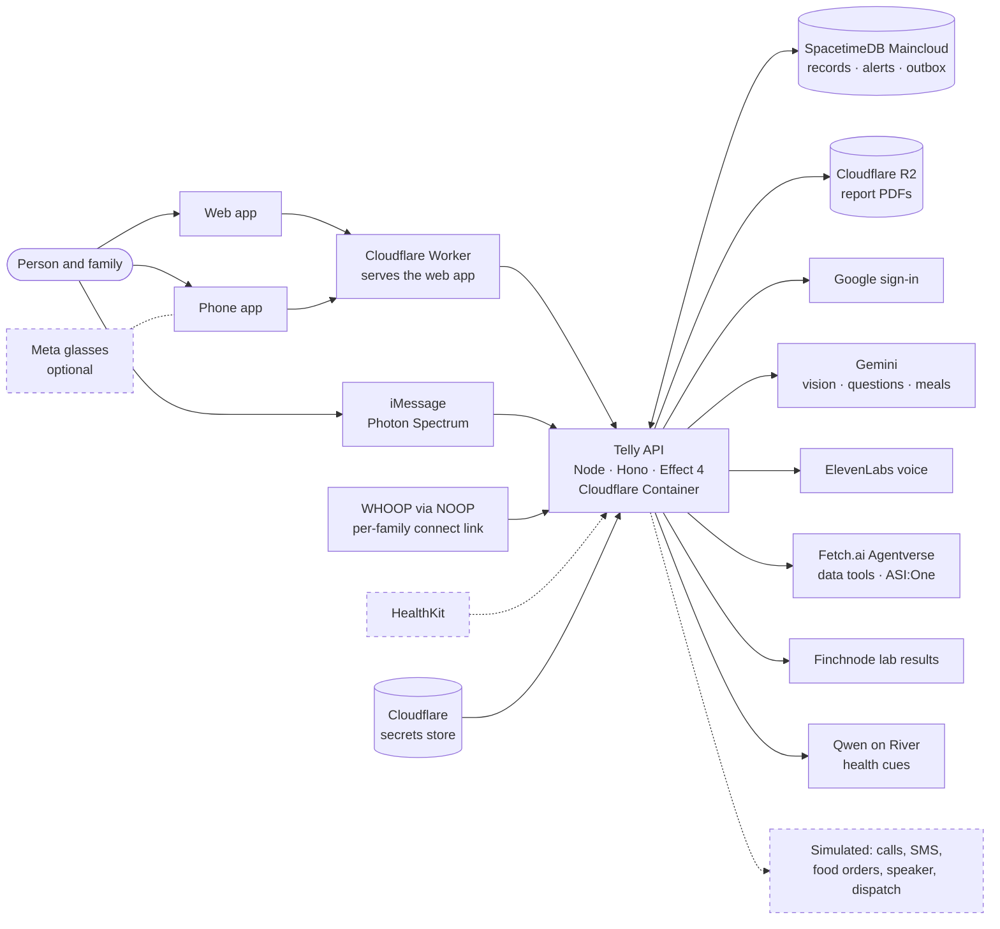
```mermaid
flowchart LR
    users(["Person and family"])
    web["Web app"]
    phone["Phone app"]
    imsg["iMessage<br/>Photon Spectrum"]
    glasses["Meta glasses<br/>optional"]
    noop["WHOOP via NOOP<br/>per-family connect link"]
    hk["HealthKit"]
    worker["Cloudflare Worker<br/>serves the web app"]
    api["Telly API<br/>Node · Hono · Effect 4<br/>Cloudflare Container"]
    secrets[("Cloudflare<br/>secrets store")]
    db[("SpacetimeDB Maincloud<br/>records · alerts · outbox")]
    r2[("Cloudflare R2<br/>report PDFs")]
    google["Google sign-in"]
    gemini["Gemini<br/>vision · questions · meals"]
    eleven["ElevenLabs voice"]
    fetch["Fetch.ai Agentverse<br/>data tools · ASI:One"]
    finch["Finchnode lab results"]
    qwen["Qwen on River<br/>health cues"]
    sim["Simulated: calls, SMS,<br/>food orders, speaker, dispatch"]

    users --> web & phone & imsg
    glasses -.- phone
    web & phone --> worker --> api
    imsg --> api
    noop --> api
    hk -.-> api
    secrets --> api
    api <--> db
    api --> r2
    api --> google & gemini & eleven & fetch & finch & qwen
    api -.-> sim

    classDef dashed stroke-dasharray: 5 5
    class glasses,hk,sim dashed
```

## Providers

Each section says how Telly uses the provider, where the code and keys are, and what proves it works. Key names are in `apps/server/.env.schema`; values live in the shared Cloudflare secrets store ([docs/cloudflare-keys.md](docs/cloudflare-keys.md)), never in Git.

<details>
<summary><strong>Gemini</strong> · medicine detection, family questions, meal photos</summary>

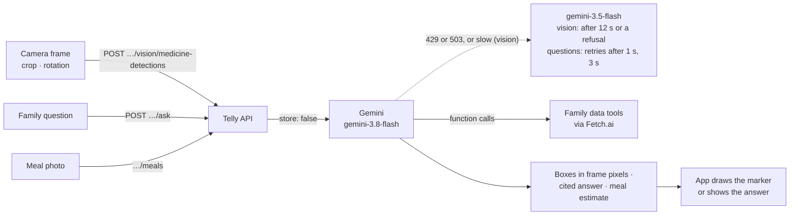
```mermaid
flowchart LR
    cam["Camera frame<br/>crop · rotation"] -->|"POST …/vision/medicine-detections"| api["Telly API"]
    q["Family question"] -->|"POST …/ask"| api
    meal["Meal photo"] -->|"…/meals"| api
    api -->|"store: false"| gem["Gemini<br/>gemini-3.8-flash"]
    gem -.->|"429 or 503, or slow (vision)"| fb["gemini-3.5-flash<br/>vision: after 12 s or a refusal<br/>questions: retries after 1 s, 3 s"]
    gem -->|"function calls"| tools["Family data tools<br/>via Fetch.ai"]
    gem --> out["Boxes in frame pixels ·<br/>cited answer · meal estimate"]
    out --> app["App draws the marker<br/>or shows the answer"]
```

- **Use:** finds medicine boxes in one camera frame (`POST …/vision/medicine-detections`), answers family questions with Fetch.ai data tools (`POST …/ask`), and estimates meals from a photo (`…/meals`). Calls use `store: false`. Vision has 30 s: `gemini-3.8-flash` gets the first 12 s, and when it answers 429 or 503 or is slower, `gemini-3.5-flash` gets the rest. Questions try `gemini-3.5-flash` at once, then both models again after 1 s and 3 s, within 45 s per question ([docs/ask.md](docs/ask.md#provider)).
- **Code:** `apps/server/src/integrations/gemini.ts`, `gemini-chat.ts`, `gemini-meal.ts`. **Key:** `GEMINI_API_KEY`.
- **Used at:** the question box on [Home](https://app.saintess.tech/), [Chat](https://app.saintess.tech/chat), [Medicine](https://app.saintess.tech/medicine), and [Meal](https://app.saintess.tech/meal).
- **Proof:** on production, 2026-10-04 09:33 UTC, **Meal** → "Rice, dal, and a glass of milk" → **Estimate** returned three items with portions and kcal (`gemini-3.8-flash`). At 12:07 UTC, a typed question answered 200 in 6.6 s with the newest WHOOP heart rate, and a medicine check answered 200 in 2.9 s ([#187 comment](https://github.com/undeemed/telly/issues/187#issuecomment-5979753457)). Earlier checks: [#174](https://github.com/undeemed/telly/pull/174), [#180](https://github.com/undeemed/telly/pull/180).
- **Limits:** the key is on the free tier, with 20 requests a day per model. When both models are out of quota or overloaded, a question says "The assistant is busy right now", and a picture check says "The picture checker is busy right now". A found box does not confirm that a dose was taken.

**Screenshots** (production, 2026-10-04):

<p>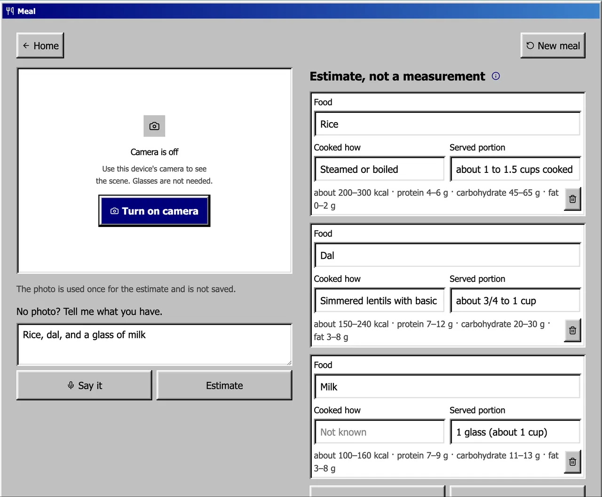</p>

<sub>1. Meal screen: Gemini estimate for rice, dal, and milk</sub>

</details>

<details>
<summary><strong>ElevenLabs</strong> · speech to text and text to speech</summary>

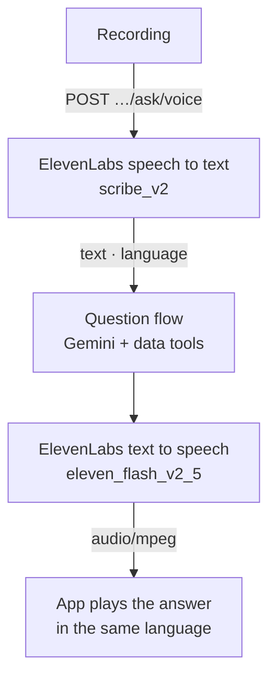
```mermaid
flowchart TB
    mic["Recording"] -->|"POST …/ask/voice"| stt["ElevenLabs speech to text<br/>scribe_v2"]
    stt -->|"text · language"| ask["Question flow<br/>Gemini + data tools"]
    ask --> tts["ElevenLabs text to speech<br/>eleven_flash_v2_5"]
    tts -->|"audio/mpeg"| app["App plays the answer<br/>in the same language"]
```

- **Use:** transcribes voice requests (`scribe_v2`) and speaks answers in the request's language (`eleven_flash_v2_5`). Routes: `…/voice/transcriptions`, `…/voice/speech`, `…/ask/voice`.
- **Code:** `apps/server/src/integrations/elevenlabs.ts`, [docs/voice.md](docs/voice.md). **Keys:** `ELEVENLABS_API_KEY`, `ELEVENLABS_VOICE_ID`.
- **Used at:** **Say it** on [Meal](https://app.saintess.tech/meal) and [Chat](https://app.saintess.tech/chat), and the voice request and read-aloud on [Home](https://app.saintess.tech/).
- **Proof:** on production, 2026-10-04 09:35 UTC, `POST …/voice/speech` returned 200 `audio/mpeg` (39750 bytes). `POST …/voice/transcriptions` with that MP3 returned 200 with the same sentence, language `en` ([provider pass](data/telly-provider-pass/report.md)). Earlier checks: [#174](https://github.com/undeemed/telly/pull/174), [#180](https://github.com/undeemed/telly/pull/180).
- **Limits:** no real-device microphone test yet ([#176](https://github.com/undeemed/telly/issues/176)).

**Screenshots** (production, 2026-10-04):

<p>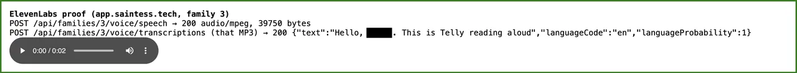</p>

<sub>1. Read-aloud MP3 and its transcription, both 200</sub>

</details>

<details>
<summary><strong>Fetch.ai Agentverse</strong> · agent tool routing and ASI:One chat</summary>

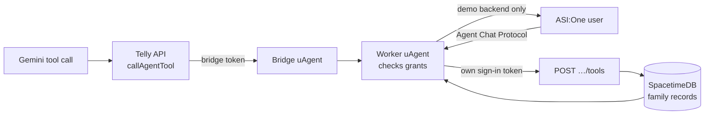
```mermaid
flowchart LR
    gem["Gemini tool call"] --> api["Telly API<br/>callAgentTool"]
    api -->|"bridge token"| bridge["Bridge uAgent"]
    bridge --> worker["Worker uAgent<br/>checks grants"]
    asi["ASI:One user"] -->|"Agent Chat Protocol"| worker
    worker -->|"own sign-in token"| tools["POST …/tools"]
    tools --> db[("SpacetimeDB<br/>family records")]
    db --> worker
    worker -->|"demo backend only"| asi
```

- **Use:** Gemini calls family data tools (`health_samples`, `alerts`) through a bridge uAgent and a worker uAgent. Each question carries a delegation, so the worker reads only the asking member's family, and only while the question runs. The worker also speaks the Agent Chat Protocol: ASI:One chats reach a separate demo backend, never production records.
- **Code:** `agents/fetch/` ([README](agents/fetch/README.md), [public profile](agents/fetch/agentverse.md)), `apps/server/src/integrations/fetch.ts`, `family-tools.ts`. **Keys:** `TELLY_FETCH_BRIDGE_TOKEN`, `TELLY_FETCH_AGENT_SEED`, `TELLY_FETCH_BRIDGE_SEED` ([agents/fetch/.env.schema](agents/fetch/.env.schema)).
- **Used at:** every family question on [Home](https://app.saintess.tech/) and [Chat](https://app.saintess.tech/chat), and the [telly-fetch agent on Agentverse](https://agentverse.ai/agents/details/agent1qvz4qf64ulzrvgrr0hd7mqrsr3y5t7rgnz6yp2qdrc6jkru2e8mz7x3dql6/profile).
- **Proof:** on production, 2026-10-04 12:58 UTC (commit `5675e6a2`), a new family 4, where the worker is not a member, asked a question. `POST /ask` answered 200 in 12.6 s, and the worker log shows `alerts` 200 and `health_samples` 200 for family 4 ([#293 comment](https://github.com/undeemed/telly/issues/293#issuecomment-5980182311), [#295](https://github.com/undeemed/telly/pull/295)). The worker `telly-fetch` is registered on Agentverse, and ASI:One received answers ([#173](https://github.com/undeemed/telly/pull/173)).
- **Limits:** the worker and the bridge run on the team host, so answers that use family data need that host up. The deployed API routes its tool calls through the bridge ([#263](https://github.com/undeemed/telly/pull/263), [#295](https://github.com/undeemed/telly/pull/295)).


**Screenshots** (captured 2026-10-04 about 08:00 UTC):

<p>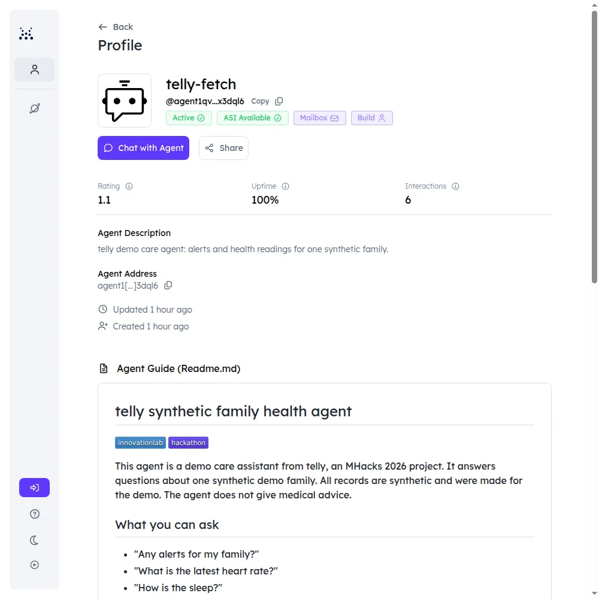 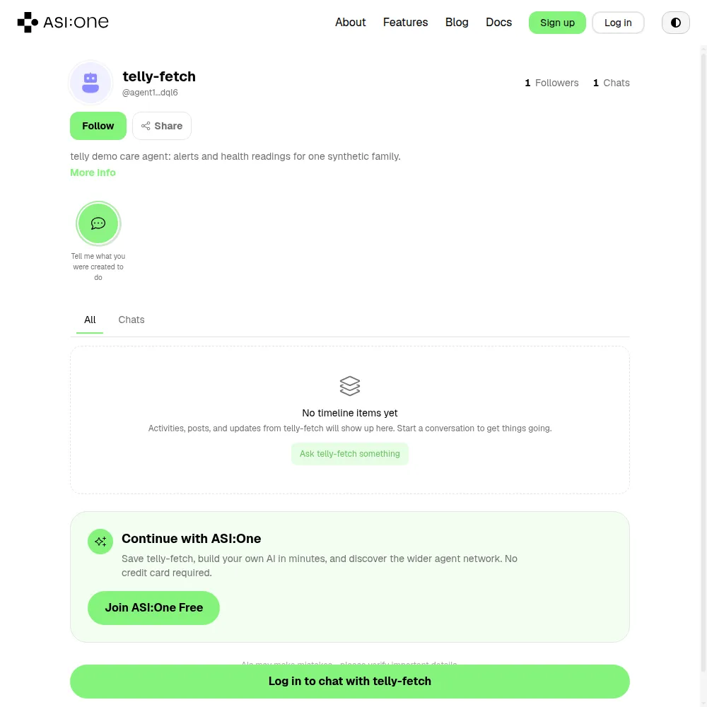 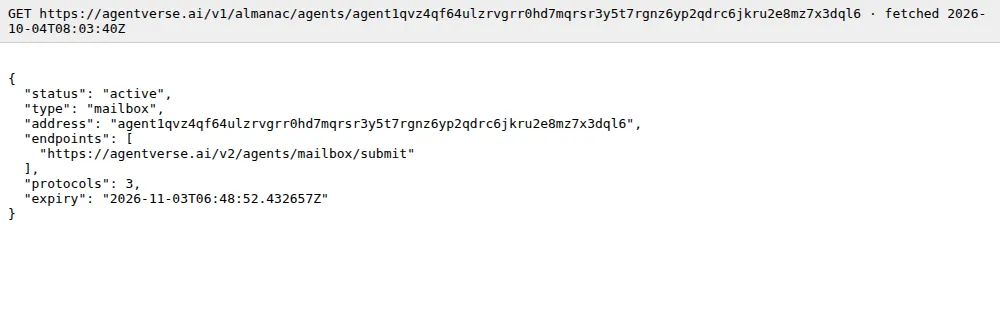</p>

<sub>1. Agentverse profile of telly-fetch: Active, ASI Available, Mailbox<br>2. ASI:One page of telly-fetch<br>3. Live Almanac record: status active, mailbox endpoint</sub>

</details>

<details>
<summary><strong>Finchnode</strong> · laboratory results</summary>

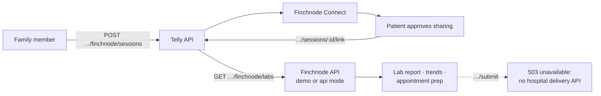
```mermaid
flowchart LR
    fam["Family member"] -->|"POST …/finchnode/sessions"| api["Telly API"]
    api --> connect["Finchnode Connect"]
    connect --> pt["Patient approves sharing"]
    pt -->|"…/sessions/:id/link"| api
    api -->|"GET …/finchnode/labs"| finch["Finchnode API<br/>demo or api mode"]
    finch --> use["Lab report · trends ·<br/>appointment prep"]
    use -.->|"…/submit"| no["503 unavailable:<br/>no hospital delivery API"]
```

- **Use:** reads lab results through Finchnode Connect for reports, trends, and appointment preparation. `FINCHNODE_MODE` is `off`, `demo` (keyless public demo, fictional patients), or `api`.
- **Code:** `apps/server/src/integrations/finchnode.ts`. **Key:** `FINCHNODE_API_KEY` (sandbox).
- **Used at:** [Reports](https://app.saintess.tech/reports) → **Markers** → **Fetch health data from Finchnode**, and [Trends](https://app.saintess.tech/trends).
- **Proof:** on production, FinchNode Connect was completed for family 3 with the Epic sandbox test patient (synthetic records), and the Reports panel showed 25 lab results ([#269](https://github.com/undeemed/telly/pull/269)). At 2026-10-04 12:13 UTC, `GET …/finchnode/labs` answered 200 with 40 results for 14 tests ([#261 comment](https://github.com/undeemed/telly/issues/261#issuecomment-5979804898)).
- **Limits:** Finchnode only reads records. It cannot send a report to a hospital, so `…/reports/:id/submit` answers `503 unavailable` ([#8](https://github.com/undeemed/telly/issues/8)).


**Screenshots** (captured 2026-10-04):

<p>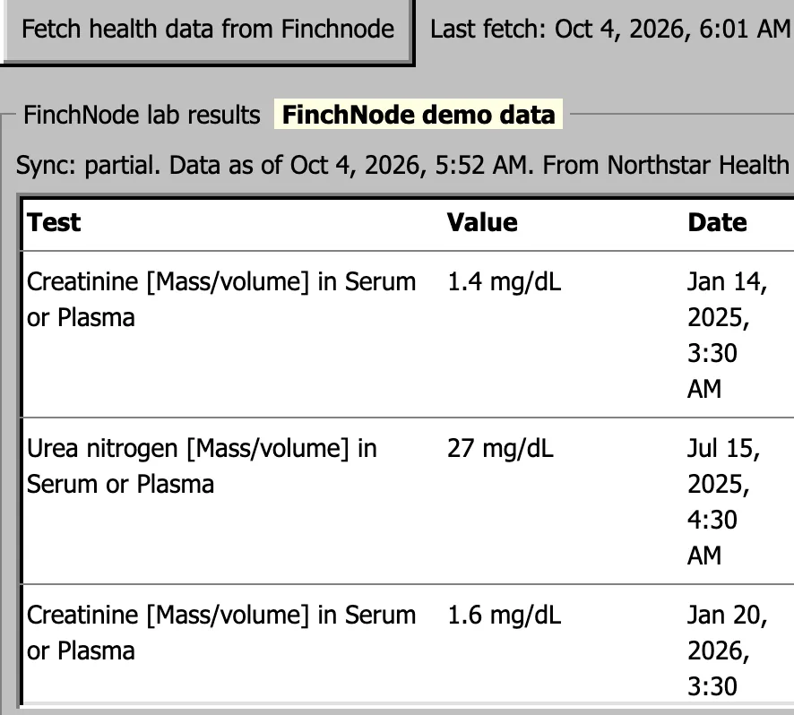 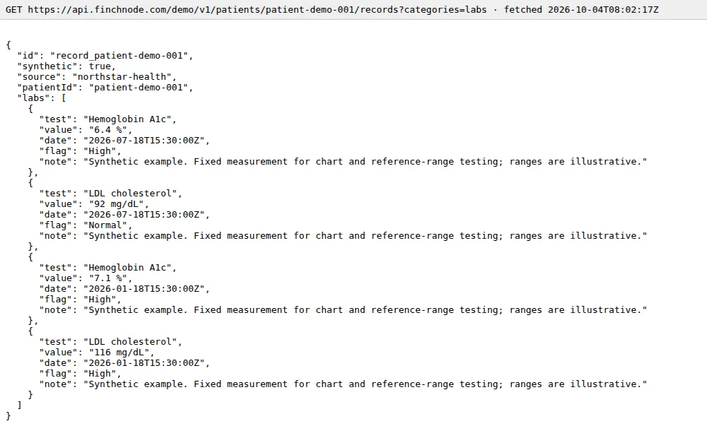 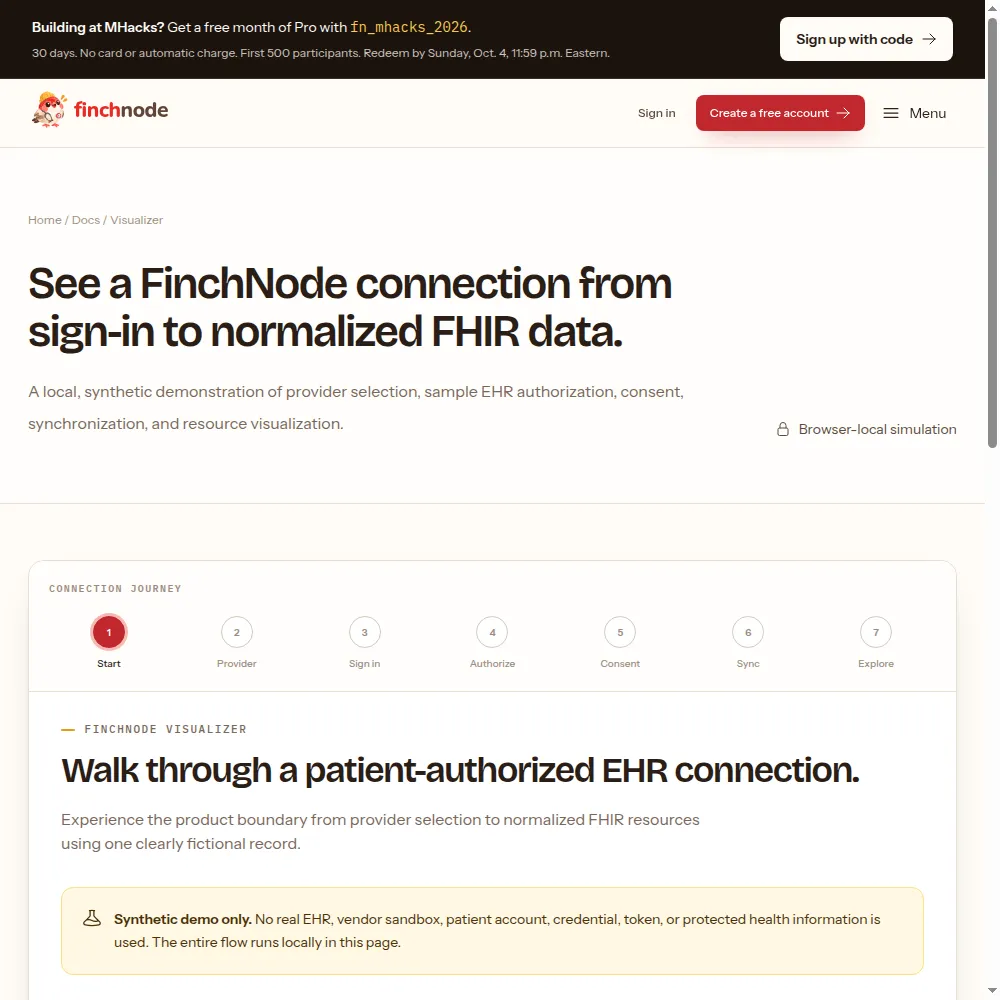</p>

<sub>1. Production Reports panel: FinchNode lab results for family 3<br>2. Live keyless demo API: synthetic labs for patient-demo-001 (fields picked from the reply)<br>3. Finchnode&#x27;s synthetic demo visualizer</sub>

</details>

<details>
<summary><strong>River AI</strong> · Qwen health-cue model</summary>

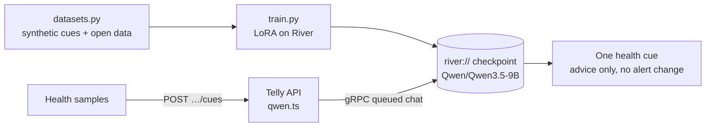
```mermaid
flowchart LR
    data["datasets.py<br/>synthetic cues + open data"] --> train["train.py<br/>LoRA on River"]
    train --> ckpt[("river:// checkpoint<br/>Qwen/Qwen3.5-9B")]
    samples["Health samples"] -->|"POST …/cues"| api["Telly API<br/>qwen.ts"]
    api -->|"gRPC queued chat"| ckpt
    ckpt --> cue["One health cue<br/>advice only, no alert change"]
```

- **Use:** a `Qwen/Qwen3.5-9B` LoRA, trained on River, turns health samples into one short health cue (`POST …/cues`). Cues are advice only; they never change thresholds or alerts. River offers no Gemma model for this key, so the plan's Gemma step uses Qwen.
- **Code:** `training/qwen/` ([README](training/qwen/README.md)), `apps/server/src/integrations/qwen.ts`. **Keys:** `RIVER_API_KEY`, `QWEN_BASE_URL`, `QWEN_BASE_MODEL`, `QWEN_CHECKPOINT`.
- **Used at:** no screen calls it yet. The production route is `POST https://api.saintess.tech/api/families/:familyId/cues`.
- **Proof:** on production, 2026-10-04 13:46 UTC (commit `0d2b1409`), `POST …/cues` for family 3 with its three newest WHOOP heart-rate samples answered 200 in 5.6 s: "No cue right now.", from the River checkpoint. An earlier check at 13:14 UTC gave the same answer ([#312](https://github.com/undeemed/telly/issues/312), [#265](https://github.com/undeemed/telly/pull/265)). Training run `2058ed15-9c11-4d2f-9307-ae0c25113f7a` finished on River (loss 1.381 → 0.452) ([#177](https://github.com/undeemed/telly/pull/177)).
- **Limits:** River approved no dedicated deployment for the base model, so each cue waits in River's queue (3 to 12 s).

**Screenshots** (production, 2026-10-04 13:46 UTC):

<p>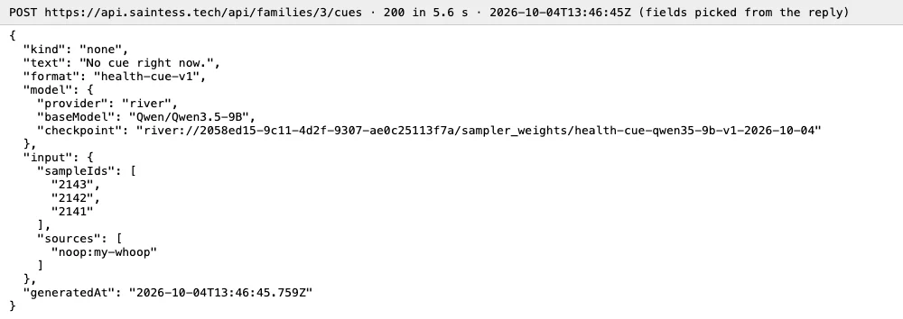</p>

<sub>1. Production <code>POST …/cues</code> reply from the River checkpoint (fields picked from the reply)</sub>

</details>

<details>
<summary><strong>Photon Spectrum</strong> · family questions over iMessage</summary>

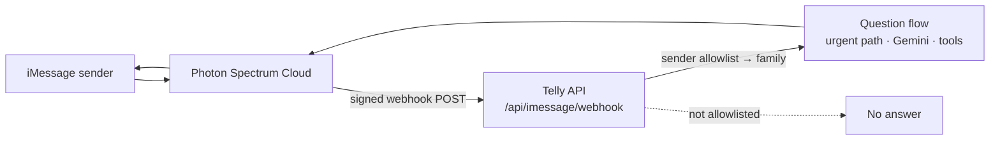
```mermaid
flowchart LR
    phone["iMessage sender"] --> spectrum["Photon Spectrum Cloud"]
    spectrum -->|"signed webhook POST"| agent["Telly API<br/>/api/imessage/webhook"]
    agent -->|"sender allowlist → family"| ask["Question flow<br/>urgent path · Gemini · tools"]
    agent -.->|"not allowlisted"| drop["No answer"]
    ask --> spectrum
    spectrum --> phone
```

- **Use:** an allowed iMessage sender, mapped to one family, asks a question. Telly marks the message Read and shows typing at once, then answers through the same question flow as the app, including the urgent-help path. A greeting, thanks, or goodbye gets one Gemini call without tools, so it calls no Fetch.ai tool; the tools that one answer calls run in parallel.
- **Code:** `apps/server/src/imessage/`. Spectrum Cloud POSTs each message to `https://api.saintess.tech/api/imessage/webhook`. A cron request every 5 minutes keeps the API warm, so a reply does not wait for a cold start ([docs/deploy.md](docs/deploy.md), [#322](https://github.com/undeemed/telly/pull/322)). **Keys:** `SPECTRUM_PROJECT_ID`, `SPECTRUM_PROJECT_SECRET`, `SPECTRUM_WEBHOOK_SECRET` (returned once when the webhook is registered), `TELLY_IMESSAGE_SENDERS`.
- **Used at:** iMessage to the Telly Photon line, which posts to `https://api.saintess.tech/api/imessage/webhook`.
- **Proof:** on production (commit `e6275e3`), the owner sent "What medicines are due today?" at 2026-10-04 11:59:59 UTC, and Telly replied at 12:00:18 UTC through the signed webhook ([#285](https://github.com/undeemed/telly/pull/285), [#267](https://github.com/undeemed/telly/pull/267)).
- **Limits:** a records-backed iMessage answer needs the Fetch.ai bridge and Gemini running at the same time.

**Screenshots** (production, 2026-10-04):

<p>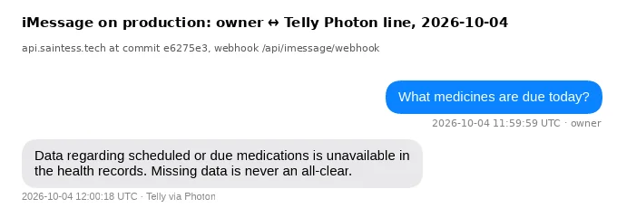</p>

<sub>1. iMessage question and Telly&#x27;s reply</sub>

</details>

<details>
<summary><strong>SpacetimeDB</strong> · family records, alerts, and the delivery outbox</summary>

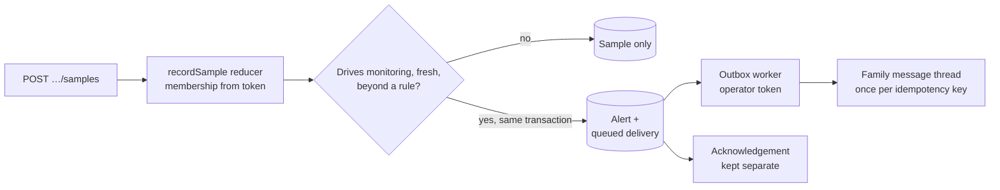
```mermaid
flowchart LR
    sample["POST …/samples"] --> red["recordSample reducer<br/>membership from token"]
    red --> rules{"Drives monitoring, fresh,<br/>beyond a rule?"}
    rules -->|"no"| store[("Sample only")]
    rules -->|"yes, same transaction"| alert[("Alert +<br/>queued delivery")]
    alert --> outbox["Outbox worker<br/>operator token"]
    outbox --> thread["Family message thread<br/>once per idempotency key"]
    alert --> ack["Acknowledgement<br/>kept separate"]
```

- **Use:** the module in `spacetimedb/` holds family-scoped tables and reducers. When a sample that drives monitoring arrives (a validated reading, or a real WHOOP reading through NOOP), the same transaction checks the rules and writes an alert with its queued delivery. The database decides family membership from the caller's token, and reads of samples, alerts, reports, and reminder history need the `health_records` sharing scope ([#318](https://github.com/undeemed/telly/pull/318)). Only the server imports the bindings (`packages/db`).
- **Where:** SpacetimeDB Maincloud, database `telly` ([docs/deploy.md](docs/deploy.md)). **Keys:** `SPACETIMEDB_URI`, `SPACETIMEDB_DATABASE`, `ALERT_OPERATOR_TOKEN`.
- **Used at:** every signed-in screen, for example the [Dashboard](https://app.saintess.tech/dashboard).
- **Proof:** every production check in this section reads or writes Maincloud database `telly`; the real WHOOP export wrote 2,223 samples to it ([#244](https://github.com/undeemed/telly/pull/244), [#212](https://github.com/undeemed/telly/pull/212)). Cross-family denial, outbox replay, crash recovery, and backup restore run on a real local database in CI (`bun run db:test`, `bun run db:drill`; [#62](https://github.com/undeemed/telly/pull/62), [#67](https://github.com/undeemed/telly/pull/67), [#73](https://github.com/undeemed/telly/pull/73)).

**Screenshots** (captured 2026-10-04 about 08:00 UTC):

<p>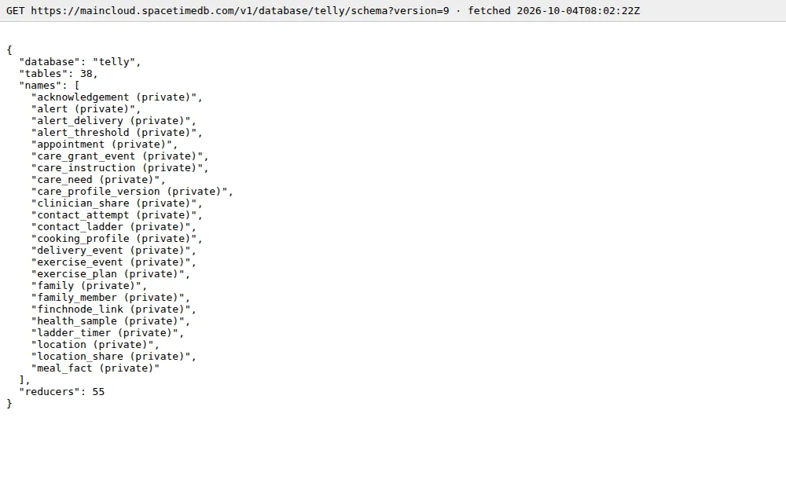</p>

<sub>1. Live Maincloud schema of database telly: 38 private tables, 55 reducers (first 24 names shown)</sub>

</details>

<details>
<summary><strong>Google</strong> · sign-in</summary>

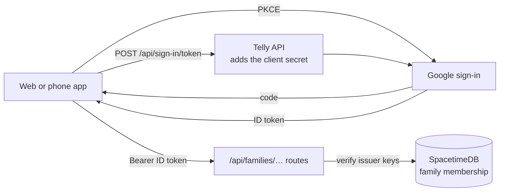
```mermaid
flowchart LR
    app["Web or phone app"] -->|"PKCE"| google["Google sign-in"]
    google -->|"code"| app
    app -->|"POST /api/sign-in/token"| api["Telly API<br/>adds the client secret"]
    api --> google
    google -->|"ID token"| app
    app -->|"Bearer ID token"| routes["/api/families/… routes"]
    routes -->|"verify issuer keys"| db[("SpacetimeDB<br/>family membership")]
```

- **Use:** OpenID Connect sign-in with PKCE. The server exchanges the code (`/api/sign-in/token`, `/api/sign-in/callback`), and the phone stores the session in SecureStore. Every `/api/families/…` route checks the token and the family membership. Without a valid session, every web page shows only the sign-in screen, which returns to the requested page after sign-in.
- **Code:** `apps/server/src/auth.ts`, `routes/sign-in.ts`. **Keys:** `OIDC_ISSUER`, `OIDC_AUDIENCE`, `OIDC_CLIENT_SECRET`.
- **Used at:** [Sign in](https://app.saintess.tech/sign-in).
- **Proof:** on 2026-10-04, Google Auth Platform shows the publishing status **In production**, user type External. A real Google sign-in on production gave `/api/me` 200 and `/api/families` 200 ([#212](https://github.com/undeemed/telly/pull/212)). A forged token got 401 ([#162](https://github.com/undeemed/telly/pull/162)).
- **Limits:** the consent screen is in production (External), so any Google account can sign in. No phone sign-in has run on a device.


**Screenshots** (captured 2026-10-04 about 08:00 UTC):

<p>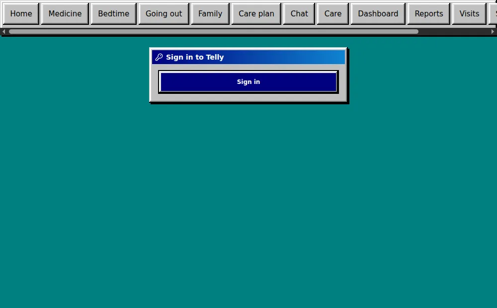 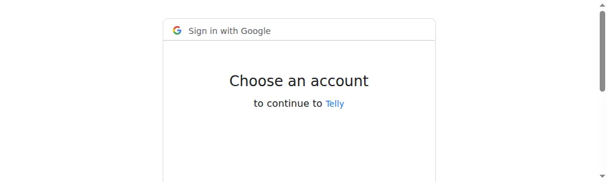 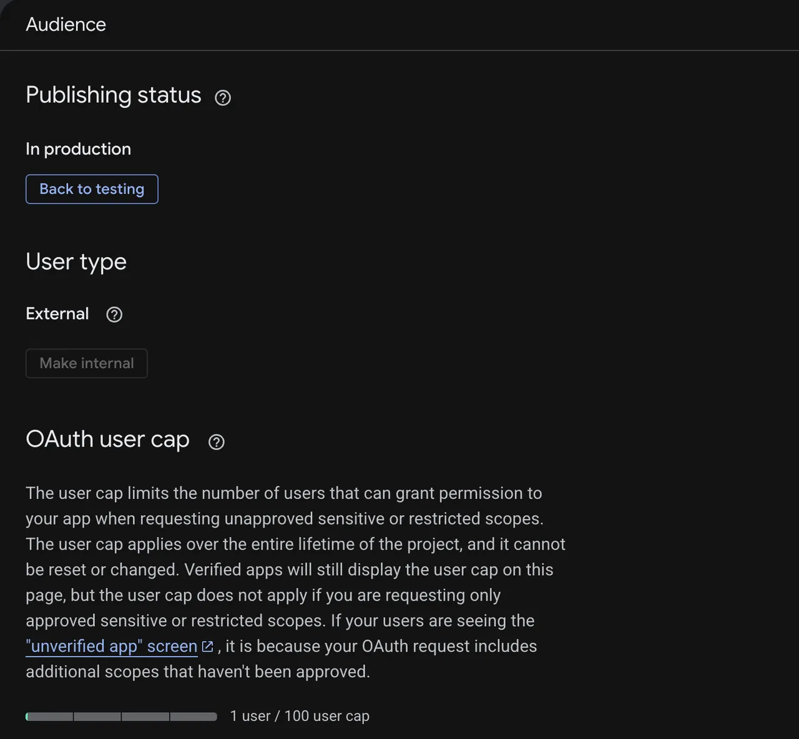</p>

<sub>1. Telly&#x27;s sign-in screen on the deployed app<br>2. Google&#x27;s account chooser for the Telly client (saved accounts removed before capture)<br>3. Google Auth Platform: publishing status In production</sub>

</details>

<details>
<summary><strong>Cloudflare</strong> · hosting, secrets, and report storage</summary>

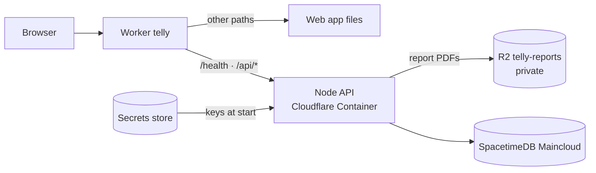
```mermaid
flowchart LR
    browser["Browser"] --> worker["Worker telly"]
    worker -->|"other paths"| web["Web app files"]
    worker -->|"/health · /api/*"| api["Node API<br/>Cloudflare Container"]
    secrets[("Secrets store")] -->|"keys at start"| api
    api -->|"report PDFs"| r2[("R2 telly-reports<br/>private")]
    api --> db[("SpacetimeDB Maincloud")]
```

- **Use:** the Worker `telly` serves the web app and sends `/health` and `/api/*` to the Node API in a Cloudflare Container. The container pulls its keys from the secrets store at start. Report PDFs and AR medicine-pin world maps (`ar-pins/<familyId>/<containerId>.worldmap`) go to the private R2 bucket `telly-reports`.
- **Code:** `deploy/cloudflare/`, [docs/deploy.md](docs/deploy.md), [docs/cloudflare-keys.md](docs/cloudflare-keys.md), `apps/server/src/integrations/r2.ts`. **Keys:** `TELLY_R2_*`.
- **Used at:** [app.saintess.tech](https://app.saintess.tech/) ([live commit](https://app.saintess.tech/version.txt)), [API health](https://api.saintess.tech/health), and [Reports](https://app.saintess.tech/reports) → **Save as PDF** → **Past PDFs** for R2.
- **Proof:** on production, 2026-10-04 09:35 UTC, **Download** of a saved report gave a presigned `r2.cloudflarestorage.com` link (300 s) to a 2-page PDF. At 09:40 UTC, every key in `TELLY_PULL_KEYS` was Active in the secrets store ([provider pass](data/telly-provider-pass/report.md)). At 13:40 UTC, the CI deploy of `0d2b1409` passed ([run](https://github.com/undeemed/telly/actions/runs/37206245026)), and `version.txt` shows that commit.
- **Deploys:** each push to `main` that changes app files runs [`health-deploy.yml`](.github/workflows/health-deploy.yml). The build goes to the candidate Worker first and reaches `telly` only when the candidate passes the signed-out smoke check; a live failure rolls back to the last good build ([#310](https://github.com/undeemed/telly/pull/310), [#292](https://github.com/undeemed/telly/pull/292)). A cron request every 5 minutes keeps the API warm, and the web app waits through a cold start instead of showing an error ([#307](https://github.com/undeemed/telly/pull/307), [#322](https://github.com/undeemed/telly/pull/322)). Details: [docs/deploy.md](docs/deploy.md).

**Screenshots** (captured 2026-10-04):

<p>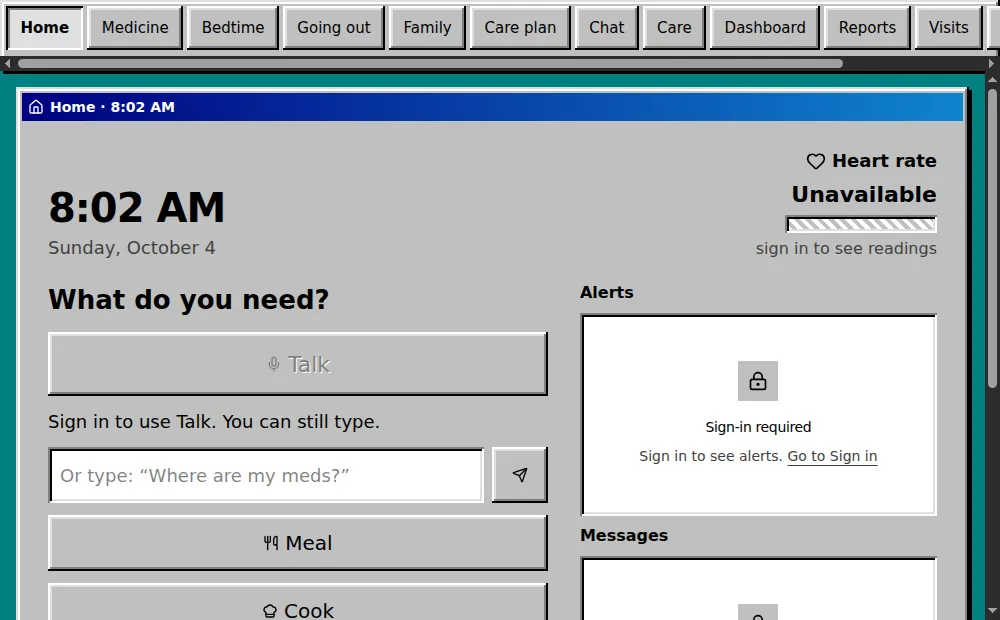 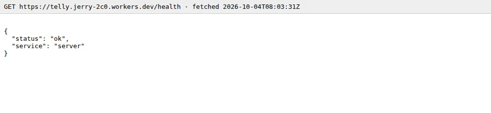 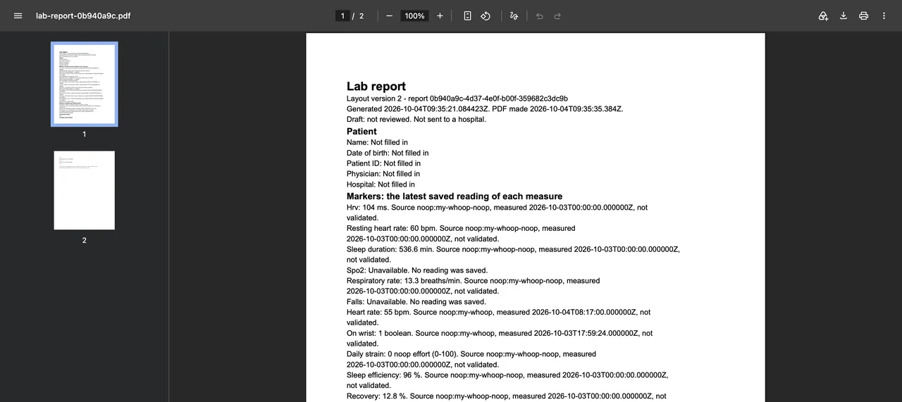</p>

<sub>1. Deployed web app on the Worker, signed out<br>2. Deployed API /health<br>3. Report PDF downloaded from R2 (production, 09:35 UTC)</sub>

</details>

<details>
<summary><strong>Resend</strong> · email of reviewed lab reports</summary>

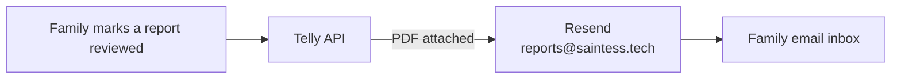
```mermaid
flowchart LR
    review["Family marks a report reviewed"] --> api["Telly API"]
    api -->|"PDF attached"| resend["Resend<br/>reports@saintess.tech"]
    resend --> inbox["Family email inbox"]
```

- **Use:** when a family member marks a lab report as reviewed, the server emails the PDF to the addresses set in Settings. **Send by email** retries by hand.
- **Code:** `apps/server/src/integrations/resend.ts`. **Keys:** `RESEND_API_KEY`, `REPORT_EMAIL_FROM`.
- **Used at:** [Settings → Reports](https://app.saintess.tech/settings/reports) and the **Send** tab of [Reports](https://app.saintess.tech/reports).
- **Proof:** on 2026-10-04 13:10 UTC, the Resend dashboard shows the domain `saintess.tech` as **Verified**. The newest email, "Reviewed lab report from Telly" from `reports@saintess.tech` with the PDF attached, was Delivered at 12:00 UTC ([#312](https://github.com/undeemed/telly/issues/312), [#201](https://github.com/undeemed/telly/pull/201)).

**Screenshots** (captured 2026-10-04):

<p>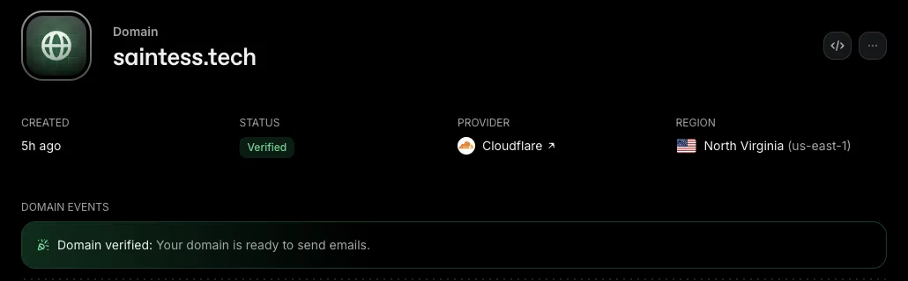</p>

<sub>1. Resend: domain saintess.tech Verified</sub>

</details>

<details>
<summary><strong>WHOOP via NOOP</strong> · live strap readings</summary>

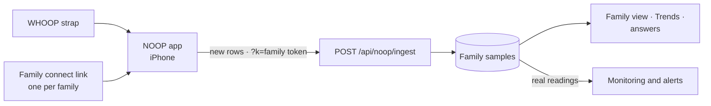
```mermaid
flowchart LR
    strap["WHOOP strap"] --> noop["NOOP app<br/>iPhone"]
    link["Family connect link<br/>one per family"] --> noop
    noop -->|"new rows · ?k=family token"| api["POST /api/noop/ingest"]
    api --> db[("Family samples")]
    db --> show["Family view · Trends ·<br/>answers"]
    db -->|"real readings"| alert["Monitoring and alerts"]
```

- **Use:** a family member taps **Connect** next to WHOOP in setup and sends the link to the person with the strap. They open it on the iPhone that runs NOOP, and NOOP pushes new strap rows to `POST /api/noop/ingest?k=<family token>`. A new link stops the old one. Real WHOOP readings drive monitoring and alerts like any other reading ([#272](https://github.com/undeemed/telly/pull/272)).
- **Code:** `apps/server/src/integrations/noop-ingest.ts`, [`noop/`](noop). **Keys:** `NOOP_SPACETIMEDB_TOKEN` (with `SPACETIMEDB_URI` and `SPACETIMEDB_DATABASE`) turns on per-family tokens (`POST /api/families/:familyId/whoop-token`). Production uses only these per-family links. The ingest answers `200` on success, because NOOP moves its cursor only on `200`.
- **Used at:** the [Family view](https://app.saintess.tech/family), the [Dashboard](https://app.saintess.tech/dashboard), [Trends](https://app.saintess.tech/family/trends), and the WHOOP **Connect** step in [setup](https://app.saintess.tech/welcome?step=connect).
- **Proof:** the real WHOOP export was written to production through the NOOP contract: 2,223 samples (2,143 heart-rate minutes, 43 wrist events, 37 daily scores) in family 3, "Telly" ([#244](https://github.com/undeemed/telly/pull/244)). On 2026-10-04 13:45 UTC, the production Family view showed these readings (heart rate 55 bpm, HRV 104 ms, sleep 536.6 min), and a River cue used the newest heart-rate samples. On a team Mac mini, a live NOOP push reached a family answer ([#174](https://github.com/undeemed/telly/pull/174), [#80](https://github.com/undeemed/telly/pull/80), [#81](https://github.com/undeemed/telly/pull/81), [#97](https://github.com/undeemed/telly/pull/97)).
- **Limits:** WHOOP shows as connected for 10 minutes after the newest push; after a restart, the status comes from the newest stored sample ([#307](https://github.com/undeemed/telly/pull/307)).

**Screenshots** (production, 2026-10-04):

<p>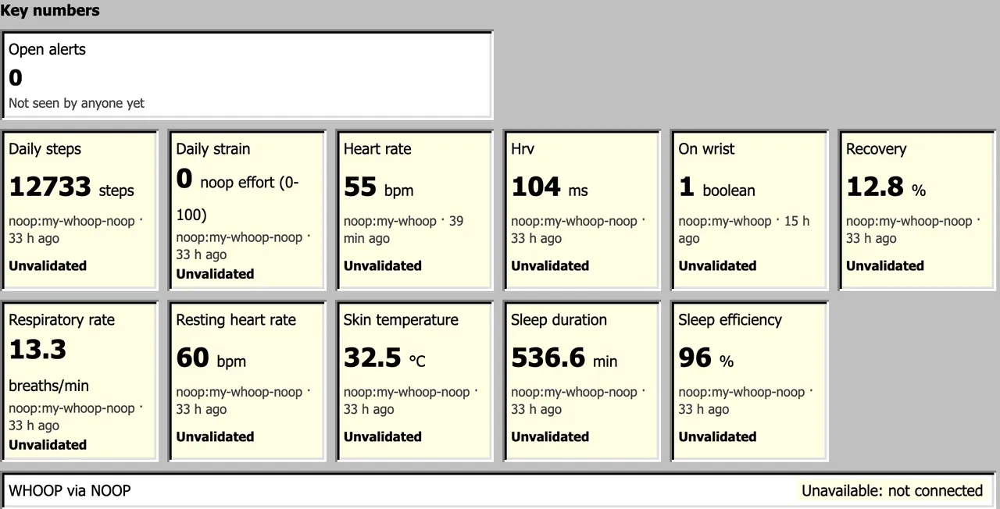</p>

<sub>1. Family view with the WHOOP readings from the export</sub>

</details>

<details>
<summary><strong>HealthKit</strong> · conditional phone import</summary>

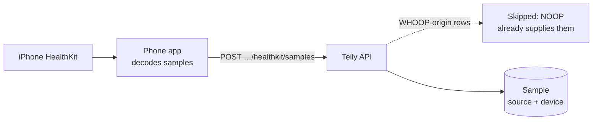
```mermaid
flowchart LR
    hk["iPhone HealthKit"] --> phone["Phone app<br/>decodes samples"]
    phone -->|"POST …/healthkit/samples"| api["Telly API"]
    api -.->|"WHOOP-origin rows"| skip["Skipped: NOOP<br/>already supplies them"]
    api --> db[("Sample<br/>source + device")]
```

- **Use:** `POST …/healthkit/samples` records decoded HealthKit samples with their source and device, without duplicates.
- **Code:** `apps/server/src/routes/healthkit.ts`, [docs/healthkit.md](docs/healthkit.md).
- **Proof:** route tests on a real local database ([#128](https://github.com/undeemed/telly/pull/128)).
- **Used at:** no screen yet; the phone app has not sent data. The production route is `POST https://api.saintess.tech/api/families/:familyId/healthkit/samples`.
- **Limits:** no iPhone has sent data yet, so there is no live proof or screenshot ([#176](https://github.com/undeemed/telly/issues/176)).

</details>

<details>
<summary><strong>Simulated, with no provider</strong></summary>

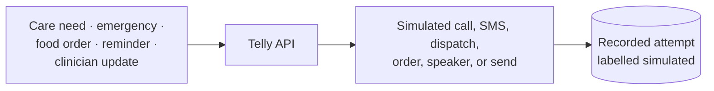
```mermaid
flowchart LR
    need["Care need · emergency ·<br/>food order · reminder ·<br/>clinician update"] --> api["Telly API"]
    api --> sim["Simulated call, SMS, dispatch,<br/>order, speaker, or send"]
    sim --> log[("Recorded attempt<br/>labelled simulated")]
```

Phone calls and SMS in the contact ladder, emergency dispatch, food orders, clinician updates from Visits, and the home speaker are simulated. Family messages stay in the app. The screens that show these actions label them as simulated.

</details>

## Status

| Area | State |
| --- | --- |
| Web app | Deployed at <https://app.saintess.tech>. Sign-in uses Google; the consent screen is in production |
| Server API and database | Deployed on Cloudflare with SpacetimeDB Maincloud; CI deploys each change through a candidate Worker |
| Phone app | iOS shell: the web app <https://app.saintess.tech> full screen in a WebView, with native Google sign-in. The self-hosted MacBook runner `telly-mac-xiao` builds the unsigned `.ipa` for SideStore ([run](https://github.com/undeemed/telly/actions/runs/37201518308), [#300](https://github.com/undeemed/telly/pull/300)). No device test yet ([#176](https://github.com/undeemed/telly/issues/176)) |
| AR medicine pin | Merged ([#303](https://github.com/undeemed/telly/pull/303)): ARKit save, relocalize, and marker on the phone; world maps go to R2. The simulation passes (`tools/ar-sim/run.py --quick`: pairing 100 %, marker 100 %, p95 error 1.78 cm and 9.3 px). No device test yet |
| Providers | See [Providers](#providers): each one lists where it is used, its live proof, and its limits |
| Hospital report delivery | Finchnode only reads records, so it cannot deliver a report. A reviewed report goes by email through Resend instead ([#201](https://github.com/undeemed/telly/pull/201)) |
| Meta glasses | Optional; needs hardware ([#18](https://github.com/undeemed/telly/issues/18), [#19](https://github.com/undeemed/telly/issues/19)) |

Open work is in the [issues](https://github.com/undeemed/telly/issues). The pinned [coordination board](https://github.com/undeemed/telly/issues/53) shows who works on what.

## Quick start

You need [Bun](https://bun.sh) 1.4.2 and Node.js 24. The [SpacetimeDB CLI](https://spacetimedb.com/install) 2.10.2 is needed only for the database commands, and [Sentrux](https://github.com/sentrux/sentrux) only for `bun run check:structure`.

```bash
bun install
bun run dev        # web on http://localhost:3001, server on http://localhost:3000
```

Use `bun run dev:web`, `bun run dev:server`, or `bun run dev:native` to start one app. Open the phone app in Expo Go. The phone app uses <https://app.saintess.tech> and <https://api.saintess.tech> by default. To use your computer, set `EXPO_PUBLIC_WEB_URL` and `EXPO_PUBLIC_SERVER_URL` to its LAN address in `apps/native/.env.local`, and start the server with `HOST=0.0.0.0`.

Each app keeps its environment variables in `.env.schema` (Varlock). Copy the values you need into an ignored `.env` file; without a provider's key, its routes answer `503 unavailable` and the screens say so. After you change a schema, run `bun run env:generate`.

<details>
<summary><strong>Server API routes</strong></summary>

<br>

Every route below `/api/families/:familyId` needs `Authorization: Bearer <ID token>` and family membership; otherwise it answers `401` or `403`. Errors use the `ApiError` contract, and request and response shapes are in `@health/contracts`.

| Area | Routes (relative to `/api/families/:familyId`) |
| --- | --- |
| Account and family | `GET /api/me`, `GET`/`POST /api/families`, `POST /api/invites/:code/join`, `GET /`, `POST /members`, `POST /invites`, `POST /whoop-token`, `POST /samples` |
| Alerts | `/alerts`, `/alerts/:id/acknowledgements`, `/alert-thresholds`, `/monitoring` |
| Questions, voice, chat | `/ask`, `/ask/voice`, `/voice/transcriptions`, `/voice/speech`, `/messages`, `/tools` ([docs/ask.md](docs/ask.md), [docs/chat.md](docs/chat.md)) |
| Medicine and meals | `/vision/medicine-detections`, `/medicine-memory`, `/meals`, `/cooking/…`, `/delivery/…` |
| Care | `/care/ladder`, `/care/needs`, `/care-profile`, `/care-instructions`, `/care-access`, `/emergency`, `/emergency/check-in` |
| Reminders | `/reminders`, `/reminder-settings`, `/reminder-occurrences/…`, `/speaker…` |
| Health data | `/cues`, `/trends`, `/finchnode/…`, `/healthkit/samples`, `/exercise/…` |
| Reports and appointments | `/reports/…`, `/report-pdfs/…`, `/appointments/…` |
| Location and trips | `/location`, `/location/shares/:identity`, `/trips/…` |

Public routes: `GET /health`, `GET /api/sources`, `POST /api/noop/ingest` (ingest key or family push token), and `/api/sign-in/*`. The source of truth is `apps/server/src/routes/`.

</details>

## Checks

```bash
bun run lint              # Biome, no writes
bun run check-types       # TypeScript in every package
bun run test              # Behavior tests
bun run check:quality     # Fallow: unused code, duplication, complexity, import boundaries
bun run check:structure   # Sentrux rules and regression gate
bun run --filter server build && bun run smoke   # Real server responses under Node
bun run db:test           # Access, alert, outbox, recovery, and lifecycle tests on a local SpacetimeDB
bun run db:drill          # Crash-restart and backup/restore drill on local data
```

After you change `spacetimedb/`, run `bun run db:generate` and commit `packages/db/` with it. CI ([`.github/workflows/health.yml`](.github/workflows/health.yml)) runs only the checks whose files changed; a change with no app code runs one `no app code changed` entry, and `structure` always runs. The one required status is `health / required`. Deployment is in [docs/deploy.md](docs/deploy.md).

<details>
<summary><strong>Database limits, backup, and restore</strong></summary>

<br>

The server bounds every database call:

| Operation | Timeout | Retries | On failure |
| --- | --- | --- | --- |
| Open a connection (`openFamilyDb`) | 5 s per attempt; sign-in caps the whole open at 10 s | 2, after 250 ms and 500 ms | `DbUnavailable`; sign-in answers `503 unavailable` |
| Reducer call (`callReducer(db, (c) => c.reducers.x(...))`, built on `callDb`) | 5 s; fails at once when the connection drops | none: a reducer call is not idempotent | `DbUnavailable` (`503 unavailable`), or `DbRejected`, which becomes `403` or `400` |
| Read cached rows (`readFamilyRecords`) | none (local) | none | throws `DbUnavailable` (`503 unavailable`) when the connection has closed |
| Shutdown (`SIGTERM`) | 3 s grace for requests in flight | none | then the server closes their sockets, which aborts each request and closes its database connection |
| Alert outbox step (operator connection) | 5 s per database step; 20 s per send; 30 s claim lease | at most 5 send attempts, after 5, 10, 20, and 40 s; the connection reopens every 5 s | a dropped connection ends the loop at once, and the worker reopens it; deliveries wait in the database |

Each request opens its own connection and closes it when the request ends or is cancelled. An outage is always an `unavailable` error, never an empty result.

Queues and retention: each alert has one delivery row, so the outbox survives a server crash, a dropped connection, and a database crash (all three are tested). The worker handles at most 4 due deliveries at a time and polls every second. Nothing is deleted automatically (owner decision, [docs/plan.md](docs/plan.md)); alerts, deliveries, and samples stay.

**Back up.** SpacetimeDB 2.10.2 has no online backup command, so take a cold backup:

1. Stop the database process (`SIGTERM`).
2. Archive the whole data directory (`--data-dir`, by default `~/.local/share/spacetime/data`): `tar -czf backup.tar.gz -C <data-dir> .`
3. Archive the identity-signing key pair with it: the files that `--jwt-priv-key-path` and `--jwt-pub-key-path` name, by default `~/.config/spacetime/id_ecdsa` and `id_ecdsa.pub`. Keep this archive as secret as the keys.
4. Start the database again.

**Restore.** Restore into a new, empty directory, never over the live one:

1. `mkdir <new-dir> && tar -xzf backup.tar.gz -C <new-dir>`
2. `spacetime start --data-dir <new-dir> --jwt-priv-key-path <key> --jwt-pub-key-path <key>.pub --listen-addr 127.0.0.1:<port>`
3. Open a connection with a known token and compare its rows with the expected values before you send traffic to it.

`bun run db:drill` runs these steps with synthetic records in temporary directories, kills the database with `SIGKILL`, restarts it, and fails unless the restored rows equal the written rows. `DRILL_PORT` picks its ports (default 3600 and 3601).

</details>

<details>
<summary><strong>CI runners</strong></summary>

<br>

Every `health` job runs on the runner that the repository variable `HEALTH_RUNNER` names (currently the self-hosted `telly-local`), and on `ubuntu-latest` when it is unset. Sentrux needs Linux AMD64 with Ubuntu 24.04. The iOS build uses `HEALTH_IOS_RUNNER` ([#300](https://github.com/undeemed/telly/pull/300)). Namespace setup record: [#21](https://github.com/undeemed/telly/issues/21).

</details>

## Repository layout

```text
apps/web/          Web app (React, Vite, TanStack Router)
apps/native/       Phone app (Expo)
apps/server/       API (Node, Hono, Effect 4); src/imessage/ is the Photon agent
packages/contracts Shared Effect Schema contracts
packages/db/       Generated SpacetimeDB bindings, server-only
packages/ui/       shadcn/ui components for the web app
spacetimedb/       Database module: family-scoped tables, reducers, views
agents/fetch/      Fetch.ai bridge and worker uAgents (Python)
training/qwen/     Qwen training and serving on River (Python)
deploy/cloudflare/ Worker, container, and public deploy settings
docs/              Approved plan, plan summary, and feature notes
noop/              NOOP, a separate project
```

Clients import only `@health/contracts` (and the web app `@health/ui`). Only the server imports database code. Fallow and Sentrux enforce this in CI.

## Contributing

Work is issue-first: find or open an issue, claim it in a comment before you edit, and open a pull request with `Refs #N`. Read [`CONTRIBUTING.md`](CONTRIBUTING.md) for the full rules. Area owners are in the [plan summary](docs/plan.md#owners).

[`noop/`](noop) holds NOOP, an existing WHOOP companion app with its own license and contributor rules ([`noop/README.md`](noop/README.md)). Telly does not build NOOP source.
