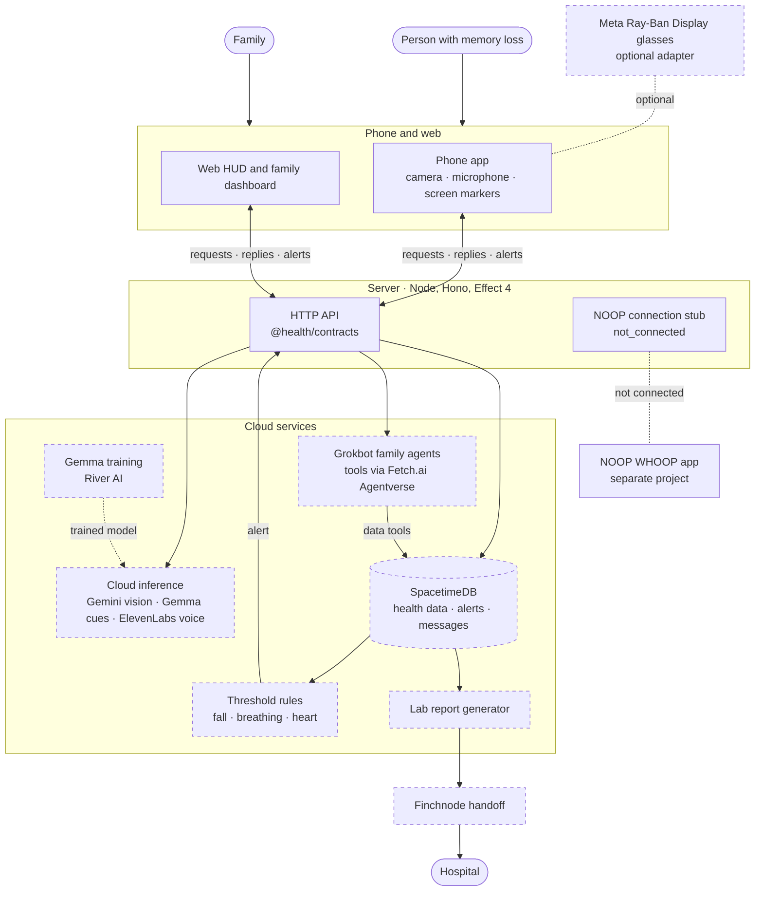

<div align="center">

# Telly

**A care assistant for a person with memory loss and their family.**<br>
Alzheimer's care first. Phone and web first. Glasses optional.

[Approved plan](docs/board.html) · [Plan summary](docs/plan.md) · [Coordination board](https://github.com/ayaangazali/telly/issues/53) · [Issues](https://github.com/ayaangazali/telly/issues) · [Contributing](CONTRIBUTING.md)

</div>

> [!IMPORTANT]
> Telly is in early development. The workspace and the typed API contracts exist. The product features do not exist yet.
> Telly is not a medical device and makes no medical safety claims.

## Overview

Telly helps a person with memory loss through the day and keeps their family informed. "Telly" is the repository name; the product name is not decided yet.

The approved plan defines these features:

- **Medicine:** find a medicine box in a phone or browser camera frame, and mark it on the screen.
- **Requests:** accept voice or text requests, and reply with screen text and multilingual audio.
- **Family:** send family messages and health alerts, and answer family questions about available health records.
- **Reports:** generate, review, and send a lab report to the hospital.
- **Monitoring:** detect falls and breathing problems only from validated signals. Show a missing signal as "unavailable", never as "all clear".

Every feature works on the phone and on the web. Meta Ray-Ban Display glasses are an optional adapter. They never gate startup or a feature.

The source of truth is the approved planning board, [`docs/board.html`](docs/board.html). Download it and open it in a browser. [`docs/plan.md`](docs/plan.md) is a short text summary.

## Status

| Area | State |
| --- | --- |
| Bun workspace: web app, phone app, server, shared packages | Ready |
| Shared API contracts (Effect Schema, `@health/contracts`) | Ready |
| Server endpoints `GET /health` and `GET /api/sources` | Ready |
| CI: lint, types, tests, Fallow, Sentrux, server build and runtime smoke | Runs on Namespace runners ([runs](https://github.com/ayaangazali/telly/actions/workflows/health.yml)) |
| NOOP-to-server connection | Stub only. Reports `not_connected`, with no transport, readings, or nudges |
| Database (SpacetimeDB) and generated server bindings | Module, bindings, and server connection are ready and tested on a local database |
| Sign-in check and family data API (server only) | OIDC token check and family access on every `/api` route except `/api/sources`. Tested with a local test issuer only. The production issuer is not chosen, and no sign-in screen exists ([#4](https://github.com/ayaangazali/telly/issues/4)) |
| Product features from the overview | Planned |
| Providers: Gemini, ElevenLabs, Grokbot, Fetch.ai Agentverse, Finchnode, Gemma on River AI | Planned. No provider is connected |
| Deployment | Planned. No hosted instance exists |
| Optional glasses adapter | Planned |

Each planned item has a [GitHub issue](https://github.com/ayaangazali/telly/issues). The pinned [coordination board](https://github.com/ayaangazali/telly/issues/53) shows who works on what. The build order is in the [plan summary](docs/plan.md#build-order).

## Quick start

You need:

- [Bun](https://bun.sh) 1.4.2 (the version in `package.json`)
- Node.js 24, for the server build and the smoke test
- Expo Go on a phone, or an iOS or Android simulator, for the phone app
- [Sentrux](https://github.com/sentrux/sentrux), only for `bun run check:structure`
- The [SpacetimeDB CLI](https://spacetimedb.com/install) 2.10.2, only for `bun run db:generate` and `bun run db:test`

Run from the repository root:

```bash
bun install
bun run dev
```

| App | Address |
| --- | --- |
| Web HUD and family dashboard | <http://localhost:3001> |
| Server | <http://localhost:3000> (`GET /health`, `GET /api/sources`, and the signed-in `/api` routes below) |
| Phone app | Open it in Expo Go |

To start one app only, use `bun run dev:web`, `bun run dev:server`, or `bun run dev:native`.

On a physical phone, set `EXPO_PUBLIC_SERVER_URL` in `apps/native/.env` to the LAN address of your computer, for example `http://192.168.1.20:3000`. Then start the server with `HOST=0.0.0.0`.

Each app keeps its environment schema in `.env.schema`. Varlock generates `src/env.ts` during `bun install`. After you change a schema, run `bun run env:generate`. Keep secrets in ignored env files, never in Git.

### Server API

All signed-in routes need `Authorization: Bearer <OIDC token>`. Set `OIDC_ISSUER`, `OIDC_AUDIENCE`, `SPACETIMEDB_URI`, and `SPACETIMEDB_DATABASE` in `apps/server/.env` (all four, or none). The database must trust the same issuer. Without them, these routes answer `503 unavailable`. Every error body is the `ApiError` contract.

| Route | Result |
| --- | --- |
| `GET /api/me` | The verified caller: issuer, subject, and database identity |
| `GET /api/families`, `POST /api/families` | The caller's families; create a family with the caller as its first member |
| `GET /api/families/:familyId` | That family's samples, alerts, messages, and acknowledgements |
| `POST /api/families/:familyId/members` | Add a person by their database identity |
| `POST /api/families/:familyId/samples` | Record a health sample; the database sets the receive time |

A caller who is not a member of the family gets `403 forbidden`. The database decides membership from the caller's token, never from the request.

## Checks

```bash
bun run lint              # Biome, no writes
bun run check-types       # TypeScript in every package
bun run test              # Behavior tests
bun run check:quality     # Fallow: unused code, duplication, complexity, import boundaries
bun run check:structure   # Sentrux rules and regression gate
bun run --filter server build && bun run smoke   # Real server responses under Node
bun run db:test           # Family-access tests on an isolated in-memory local SpacetimeDB
bun run build             # Production build of every app
```

`bun run check` runs Biome and writes fixes. After you change `spacetimedb/`, run `bun run db:generate` and commit `packages/db/` with it; never edit `packages/db/src` by hand. CI fails when the bindings are stale.

CI runs these checks in [`.github/workflows/health.yml`](.github/workflows/health.yml). The one required status is `health / required`.

<details>
<summary><strong>Namespace runners</strong></summary>

<br>

The `check` and `structure` jobs run on the runner that the repository variable `HEALTH_RUNNER` names. The current value is `nscloud-ubuntu-24.04-amd64-2x4` (Linux AMD64, Ubuntu 24.04, 2 vCPU, 4 GB). When the variable is unset, the jobs run on `ubuntu-latest`.

`changes` and `required` always run on `ubuntu-latest`, so `health / required` reports even when no Namespace runner is available.

- Linux AMD64 with Ubuntu 24.04 is necessary: the Sentrux release is an x86-64 binary, and its fallback installs `libgtk-3-0t64`, which exists only on Ubuntu 24.04.
- If a job runs out of memory, set the variable to `nscloud-ubuntu-24.04-amd64-4x8`.
- To return to GitHub-hosted runners, delete the variable: `gh variable delete HEALTH_RUNNER -R ayaangazali/telly`.

The setup record is in [#21](https://github.com/ayaangazali/telly/issues/21).

</details>

## Architecture

This diagram follows the system diagram in the [approved plan](docs/board.html). Solid boxes exist today. Dashed boxes are planned.



| Part | Technology |
| --- | --- |
| Web HUD and family dashboard | React, Vite, TanStack Router |
| Phone app | Expo (React Native) |
| Server | Node, Hono for HTTP, Effect 4 for service logic |
| Contracts | Effect Schema in `@health/contracts` |
| Data | SpacetimeDB (TypeScript module in `spacetimedb/`, generated bindings in `@health/db`) |
| Providers (planned) | Gemini vision, ElevenLabs voice, Grokbot family agents and messages, Fetch.ai Agentverse tool routing, Finchnode report handoff, Gemma on River AI |

```text
apps/
  web/          Web HUD and family dashboard
  native/       Phone app
  server/       Server; src/integrations/noop.ts is the NOOP stub
packages/
  contracts/    Shared Effect Schema API contracts
  config/       Shared strict TypeScript configuration
  ui/           shadcn/ui components for the web app
  db/           Generated SpacetimeDB bindings, server-only (bun run db:generate)
spacetimedb/    SpacetimeDB module: family-scoped tables, reducers, and views
docs/           Approved planning board and plan summary
noop/           NOOP, a separate project
```

Clients import only `@health/contracts`, and the web app also imports `@health/ui`. Only the server can import database code. Fallow and Sentrux enforce these rules in CI.

Later issues add `agents/fetch/` and `training/gemma/`.

## Contributing

Work is issue-first:

1. Find or open an issue with the "Health task" template.
2. Claim it in a comment before you edit, and post progress there.
3. Open a pull request that refers to the issue with `Refs #N`.

Read [`CONTRIBUTING.md`](CONTRIBUTING.md) for the full rules. Use the [coordination board](https://github.com/ayaangazali/telly/issues/53) for short claim and handoff notes. Area owners are in the [plan summary](docs/plan.md#owners).

## NOOP

[`noop/`](noop) holds NOOP, an existing WHOOP companion app. It is a separate project with its own license and contributor rules; see [`noop/README.md`](noop/README.md). Telly does not import or build NOOP source code.
