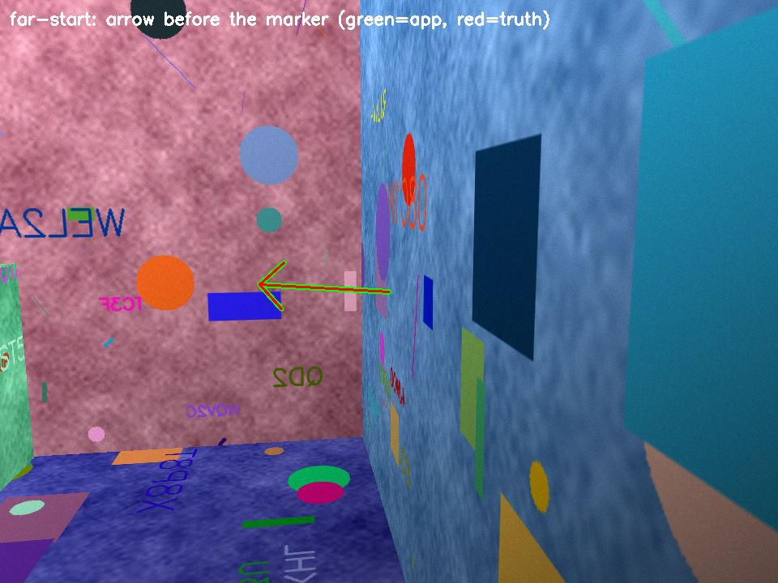
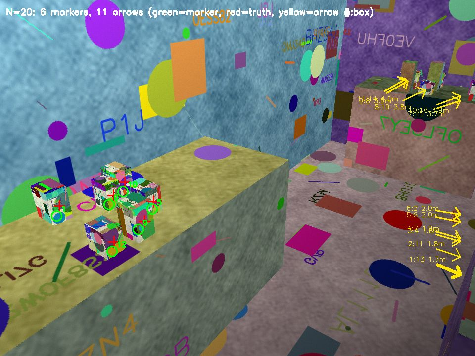
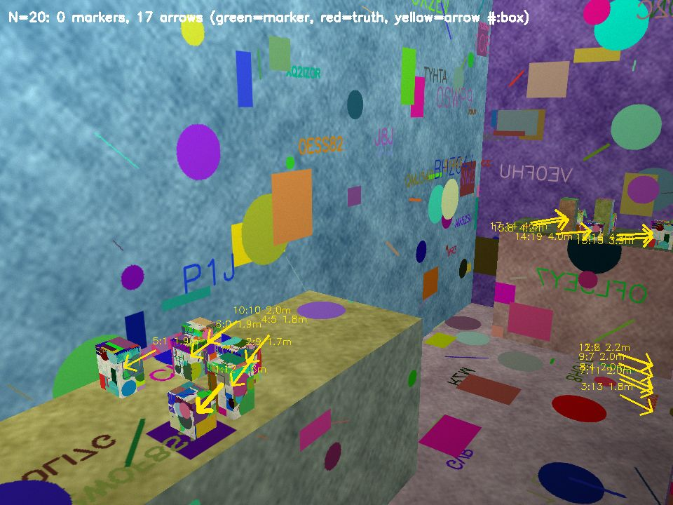
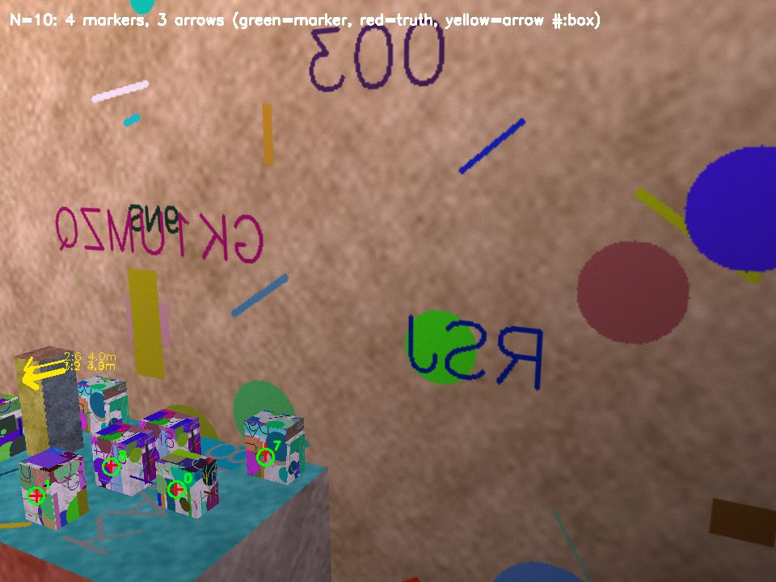

# AR pin simulation: overview

`tools/ar-sim/` is a headless 3D simulation of the Telly AR medicine pin. ARKit does not run in the iOS Simulator, so the simulation renders rooms from a virtual iPhone camera on Linux and runs the save, relocalize, and project pipeline against those frames. It supports the medicine finder in the [plan](../plan.md#product) and the AR pin contract (slice D).

- [Procedures](procedures.md): commands, scenarios, pass criteria, how to read the results, how to add a scenario.
- [Real-device checks](real-device.md): the matching real-iPhone check for each scenario.

## What the simulation proves

- The pipeline logic works end to end: a feature map and named anchors go into the `ar.pinSaved` shape (base64 of a zlib archive) and come back through `ar.findPin`, the anchors relocalize, and they project onto the right point of the frame.
- The app's guidance loop works: pairing mode until the first fix, an arrow after it, and a marker only after a second fix that agrees within 5 cm. With many objects, it gives an arrow for each object that has no marker, nearest first.
- It shows where the pipeline fails and what the app must show then (the failure cases), and which design choices matter with many objects in one room (how to pin, when to draw a label).
- It measures the shape of the problem: errors in centimetres and pixels, wrong markers, time to the first and the last marker, and map sizes.
- It shows how a usual-place learner behaves with 30 days of sightings for each member, and how many days of data it needs.

## What it does not prove

- **It does not measure ARKit.** The tracker in the simulation is ORB features, PnP with RANSAC, and simulated VIO. Apple's tracker is better in some ways (global map optimisation, loop closure, plane detection) and different in others. A real iPhone can be better or worse than these numbers.
- **The drift, noise, and depth values are assumptions,** not iPhone measurements: VIO drift of 1 percent of the distance and 0.05 degrees per frame, camera noise, and LiDAR depth noise of 0.3 cm plus 1 percent.
- **The rooms are boxes with procedural textures.** Real rooms have reflections, repeated patterns, soft objects, and things that move between sessions.
- **The people follow the app exactly.** Real people turn faster, stop, and miss instructions.
- **The usual-place data is simulated.** Real habits are not fixed probabilities.

Confirm each result on a real iPhone with the [real-device checks](real-device.md) before you make a claim about the device.

## How the simulation maps to ARKit on a real iPhone

| Simulation (`tools/ar-sim/`) | ARKit on a real iPhone |
|---|---|
| `render.py`: frames of a textured room at 960 x 720, fx = 750 px, with lighting, blur, noise, and auto exposure | `ARFrame.capturedImage` from the wide camera (1920 x 1440, about 65 degrees horizontal FOV) |
| VIO poses with drift (`vio_step`, `vio_walk`) | `ARCamera.transform` from world tracking |
| ORB feature map from session 1, triangulated from the VIO poses | The feature points inside `ARWorldMap` |
| Each container's step toward it is moved onto the map by PnP fixes (`onto_map`) | Tracking against the map that ARKit already built |
| Anchor `telly-pin-<containerId>` in map coordinates | `ARAnchor(name: "telly-pin-<containerId>")` |
| Hit test: median depth of map points around the tap (`raycast`) | `raycastQuery(from:allowing: .estimatedPlane, alignment: .any)` on iPhones without LiDAR |
| Hit test: LiDAR depth at the tap (`depth_at`) | The same raycast on Pro iPhones, which uses `sceneDepth` |
| `save_pin`: `np.savez` of the map and anchors, zlib, base64 | `getCurrentWorldMap`, `NSKeyedArchiver`, zlib, base64 (`ar.pinSaved.worldMap`) |
| Relocalization: ORB matches, PnP, RANSAC, two fixes that agree | `run(_:options:)` with `initialWorldMap`; tracking state goes from `.limited(.relocalizing)` to `.normal` |
| Projection of the anchor (`to_cam`, `project`) | `ARCamera.projectPoint` or the renderer that draws the anchor |
| Arrow: the direction of the anchor in the camera frame | The same vector from `ARCamera.transform` and the anchor transform |

## One container per room

`run.py` pins one medicine box in each room. These results are the merged single-object results; this change does not change them.

### What one trial does

1. **Scene.** `render.py` makes a random 5 m x 4 m x 2.6 m room with posters, a cabinet, a sofa, a bookshelf, and a 8 x 12 x 15 cm medicine box on the cabinet. It draws each face with one plane homography and a z-buffer. No GPU is necessary.
2. **Camera.** The camera is iPhone-like: 960 x 720 with fx = 750 px (the ARKit 1920 x 1440 wide camera at half resolution, about 65 degrees horizontal FOV). It adds lighting level, gradient, and colour cast, motion blur up to 6 px, shot and read noise, and auto exposure that amplifies the noise in dim light.
3. **Session 1 (save).** The camera walks an arc around the box (24 frames over 120 degrees). Its VIO poses drift by 1 percent of the distance and 0.05 degrees per frame. ORB features from frame pairs are triangulated into a map. Only points with at least 6 degrees of parallax stay in the map. A tap at the box casts a ray into the map. The anchor goes at the median depth of the map points around the tap, as an ARKit hit test does.
4. **Saved shape.** The map and the anchor go into the app's `ar.pinSaved` reply: anchor id `telly-pin-<containerId>`, and `worldMap` is base64 of a zlib-compressed archive. The trial sends that reply and the `ar.findPin` request through JSON. A baseline map is 160 to 470 KB, well under the 16 MB storage limit.
5. **Session 2 (find).** The person starts at a different pose, facing any direction, with a new origin. The light is 0.6 to 1.4 times the light of session 1, with a gradient and a colour cast. An object covers 15 to 35 percent of every frame. The person does only what the app shows, so the path depends on the app's own estimates, not on the true position of the box.
6. **Relocalize.** Each frame matches ORB features to the map and solves PnP with RANSAC (`solvePnPRansac`, 3 px), then refines the pose with Levenberg-Marquardt. A frame gives a fix when it has at least 50 inliers and the inliers spread at least 50 px in every direction. Inliers in a thin strip, such as one shelf edge, let PnP rotate about the strip and give a wrong pose that still fits.
7. **Pairing mode, then arrow, then marker.**
   - **Pairing mode (no fix yet):** the app shows "Turn slowly and look around the room", and the person turns on the spot at 15 degrees per frame. After one full turn with no fix, the app shows "Walk closer to where you pinned the medicine and look around". The trial stops counting after 48 frames (two turns). An app does not stop: it keeps pairing mode on.
   - **Arrow:** after the first fix, the app shows an arrow toward its best guess of the anchor. The person turns toward it (up to 30 degrees per frame) and walks toward it.
   - **Marker:** when two fixes put the anchor within 5 cm of each other and the anchor is on screen, the app shows the marker. One fix can be confidently wrong, so the marker waits for a second fix that agrees.
8. **Project.** Ten frames after pairing, the trial measures the 3D error (cm) and the screen error (px) of the marker against the true point on the box.

### Results

Full run, 50 baseline trials and 20 trials for each failure case:

| case | trials | map saved | pairing done | pairing turn deg (median / p95) | marker shown | 3D error cm (median / p95 / max) | screen error px (median / p95 / max) | within 5 cm and 20 px | arrow frames | arrow error deg (median / p95) |
|---|---|---|---|---|---|---|---|---|---|---|
| baseline | 50 | 100% | 100% | 90 / 263 | 100% | 1.05 / 2.45 / 3.31 | 3.9 / 10.8 / 14.2 | 100% | 76 | 0.3 / 0.8 |
| short-scan | 20 | 85% | 35% | 345 / 634 | 25% | 1.27 / 2.41 / 2.44 | 2.6 / 4.2 / 4.3 | 25% | 44 | 0.3 / 0.7 |
| featureless-walls | 20 | 100% | 45% | 135 / 498 | 20% | 1.04 / 3.65 / 4.10 | 4.0 / 11.0 / 12.3 | 20% | 66 | 0.2 / 0.7 |
| big-lighting-change | 20 | 100% | 90% | 172 / 409 | 70% | 1.22 / 1.69 / 1.98 | 5.6 / 10.3 / 12.1 | 70% | 67 | 0.4 / 14.8 |
| far-start | 20 | 100% | 90% | 112 / 481 | 90% | 1.32 / 2.72 / 3.17 | 4.4 / 11.2 / 17.4 | 90% | 23 | 0.1 / 1.0 |

The baseline passes its bar. No trial in any case put a wrong marker on the screen. When the second fix does not come, the app keeps the arrow and shows no marker. The 15-degree arrow p95 error in big-lighting-change comes from one dark trial whose only fix was 15 degrees off.

Green ring: the projected pin. Red cross: the true point on the box. In the arrow frame, the green arrow is the app's arrow and the red arrow is the true direction. The frames do not show the occluder, so you can see the box. More frames are in `tools/ar-sim/evidence/`.

### Failure cases and app guidance

| Case | Change | Result | Guidance for the app |
|---|---|---|---|
| short-scan | 4 frames over 8 degrees | Few map points. Some saves fail, and pairing often does not complete. | Save only when ARKit reports `.mapped` or `.extending`. If not, show "Move your phone slowly around the box". |
| featureless-walls | Plain walls, floor, and ceiling | Pairing often does not complete; only the furniture carries the map. | During the save, show "Point your phone at furniture or objects near the medicine". |
| big-lighting-change | 5 to 10 percent of the light, warm cast, strong gradient | Pairing drops because of noise. | In pairing mode, show "Turn on a light". Save in good light. |
| far-start | Session 2 starts 3 to 4 m away | Pairing takes longer. It completes more often with more time. | Keep pairing mode on, and show "Walk closer to where you pinned the medicine". |

More time does not help a bad map. With four turns of pairing (96 frames) instead of two, far-start pairing completed in 7 of 8 trials, featureless walls in only 2 of 8, and short scans in only 3 of 8.

## Many containers in one room

`multi.py` pins N = 1, 3, 5, 10, or 20 containers in one room with one shared world map, then finds all of them in one session. It answers the captain's question: "hows the performance on multiple objects?"

### What one room does

1. **Scene.** The single-object room plus a low table. N containers stand on the cabinet, the sofa, and the table, in groups 10 to 30 cm apart (centre to centre). About a third of them are look-alikes: identical boxes with the same label. A tall unpinned box (a cereal box, 20 to 30 cm) stands in front of about one container in four.
2. **Session 1 (save).** For each piece of furniture with containers, the camera walks an arc of 16 frames over 120 degrees. Then the person steps up to each container on it, to 0.6 to 0.9 m, and taps it. The last 20 cm of the step is sideways (4 frames). The tap view is at most 50 degrees off the front of the box. If something hides the box, the person steps around or raises the phone; if it stays hidden, the box is not pinned and the app must say "Move what is in front of the medicine".
3. **Tracking.** While the person steps up to a container, the tracker tracks against the arc that it just mapped: the step's VIO poses move onto the arc map by two PnP fixes that agree. The simulation has no global bundle adjustment, so the parts of the map from different furniture keep the VIO drift of the walks between them. Each map point keeps its part, and relocalization solves against one part at a time.
4. **Pin.** `--pin depth` (default) puts the anchor on the tap ray at the LiDAR depth, as on Pro iPhones; a tap on an edge (the depth block spans more than 3 cm) is not used. `--pin points` uses the median depth of the map points around the tap: the single-object hit test, for iPhones without LiDAR.
5. **Saved shape.** One world map holds every anchor (`telly-pin-box-<i>`) and goes through JSON as base64 of a zlib archive.
6. **Session 2 (find).** The person asks for the first pinned container and starts 1 to 2.6 m from it, facing any direction, in new light, with an occluder in every frame. Pairing is the same as for one container. After a fix that no second fix confirms, the app shows "Hold still" for up to 3 frames, so the second fix comes from the same mapped view; walking toward one unconfirmed fix leads to views that the scan never saw. When two fixes agree (every anchor within 5 cm), the app shows:
   - a labelled marker for each anchor that is on the screen and within 2 m. Farther away, boxes 10 cm apart are less than 40 px apart on the screen, too close for a marker that can be 10 to 20 px off.
   - an arrow for each other anchor, nearest first.

   The person follows the arrow to the nearest container that has not shown a marker yet, until every pinned container has shown a marker or 60 frames have passed.
7. **Measure.** Each container counts once, with its worst error over all frames that showed its marker. A marker is wrong when it is nearer another container than its own, in 3D or on the screen.

### Results

Full runs, 8 rooms for each N. The three runs use the same random draws.

**LiDAR pins, with the simulation's VIO drift** (`multi.py`, the realistic run for Pro iPhones):

| N | rooms | pinned | relocalized | markers shown | pin error at save cm (median / p95) | 3D error cm (median / p95 / max) | screen error px (median / p95 / max) | wrong markers (boxes / marker frames) | marker on a hidden box |
|---|---|---|---|---|---|---|---|---|---|
| 1 | 8 | 75% | 100% | 100% | 0.75 / 1.24 | 0.84 / 1.68 / 1.77 | 2.9 / 7.2 / 7.2 | 0 / 0 of 6 | 0% |
| 3 | 8 | 83% | 88% | 90% | 0.55 / 1.37 | 1.52 / 4.54 / 7.29 | 6.8 / 12.2 / 14.8 | 0 / 0 of 27 | 15% |
| 5 | 8 | 90% | 100% | 100% | 0.62 / 1.54 | 2.15 / 4.58 / 7.23 | 5.5 / 21.6 / 27.3 | 0 / 0 of 56 | 12% |
| 10 | 8 | 85% | 100% | 100% | 0.47 / 1.70 | 2.51 / 5.91 / 6.76 | 7.1 / 32.3 / 37.7 | 5 / 8 of 178 | 19% |
| 20 | 8 | 82% | 100% | 100% | 0.56 / 1.52 | 2.91 / 9.13 / 14.48 | 12.7 / 33.8 / 95.1 | 4 / 17 of 410 | 26% |

| N | first marker s (median / p95) | all markers s (median / p95) | all shown | arrow error deg (median / p95) | most arrows at once | map KB (median / max) | N copies of the map KB | map points (median) | peak RSS MB |
|---|---|---|---|---|---|---|---|---|---|
| 1 | 6.2 / 12.2 | 6.2 / 12.2 | 100% | 0.4 / 0.6 | 1 | 133 / 207 | 133 | 3928 | 213 |
| 3 | 8.0 / 12.5 | 10.5 / 13.4 | 88% | 0.4 / 1.0 | 3 | 287 / 459 | 860 | 7673 | 265 |
| 5 | 7.0 / 9.8 | 10.0 / 11.5 | 100% | 0.4 / 1.8 | 5 | 346 / 630 | 1728 | 9053 | 321 |
| 10 | 3.8 / 10.8 | 10.0 / 19.2 | 100% | 0.5 / 3.1 | 10 | 626 / 719 | 6264 | 16594 | 351 |
| 20 | 2.5 / 10.0 | 12.0 / 18.7 | 100% | 0.7 / 4.1 | 19 | 618 / 734 | 12367 | 16082 | 434 |

**LiDAR pins, map without VIO drift** (`multi.py --map-without-drift`, the bound if ARKit's map optimisation removes the drift; the CI gate):

| N | rooms | pinned | relocalized | markers shown | pin error at save cm (median / p95) | 3D error cm (median / p95 / max) | screen error px (median / p95 / max) | wrong markers (boxes / marker frames) | marker on a hidden box |
|---|---|---|---|---|---|---|---|---|---|
| 1 | 8 | 75% | 83% | 83% | 0.75 / 1.24 | 0.69 / 1.42 / 1.43 | 2.7 / 5.2 / 5.5 | 0 / 0 of 5 | 0% |
| 3 | 8 | 83% | 88% | 90% | 0.55 / 1.37 | 0.80 / 1.96 / 2.31 | 2.9 / 5.6 / 8.2 | 0 / 0 of 24 | 12% |
| 5 | 8 | 90% | 100% | 100% | 0.62 / 1.54 | 0.82 / 2.00 / 3.97 | 2.1 / 7.2 / 8.7 | 0 / 0 of 55 | 13% |
| 10 | 8 | 85% | 100% | 100% | 0.47 / 1.70 | 1.17 / 4.31 / 4.55 | 4.3 / 14.7 / 19.8 | 0 / 0 of 175 | 17% |
| 20 | 8 | 82% | 100% | 100% | 0.56 / 1.52 | 1.33 / 2.32 / 3.15 | 5.3 / 11.4 / 22.9 | 0 / 0 of 417 | 27% |

**Map-point pins, with VIO drift** (`multi.py --pin points`, iPhones without LiDAR):

| N | rooms | pinned | relocalized | markers shown | pin error at save cm (median / p95) | 3D error cm (median / p95 / max) | screen error px (median / p95 / max) | wrong markers (boxes / marker frames) | marker on a hidden box |
|---|---|---|---|---|---|---|---|---|---|
| 1 | 8 | 75% | 100% | 100% | 1.22 / 3.27 | 1.22 / 3.10 / 3.42 | 5.5 / 11.1 / 12.0 | 0 / 0 of 6 | 0% |
| 3 | 8 | 75% | 100% | 100% | 1.06 / 4.15 | 1.93 / 4.18 / 4.40 | 6.0 / 14.6 / 15.6 | 0 / 0 of 26 | 15% |
| 5 | 8 | 92% | 100% | 100% | 0.89 / 3.93 | 2.12 / 4.77 / 19.46 | 6.2 / 21.6 / 68.6 | 1 / 2 of 57 | 12% |
| 10 | 8 | 81% | 100% | 100% | 1.15 / 16.02 | 2.21 / 16.57 / 223.56 | 8.0 / 82.1 / inf | 8 / 16 of 152 | 16% |
| 20 | 8 | 76% | 100% | 100% | 1.19 / 10.14 | 3.43 / 13.32 / 191.63 | 12.3 / 50.8 / inf | 8 / 14 of 356 | 21% |

In the other two runs, the times are similar, and the drift-free maps are about 15 percent smaller (518 KB median at N = 20). Each run prints its own time and size table.

Green ring: a marker, with the container number. Red cross: the true point. Yellow arrows: containers without a marker, as "rank:container distance", nearest first and thickest. An arrow ends at its container when the container is on the screen but farther than 2 m.

### What the results mean

- **Up to 5 containers, the bar holds with LiDAR pins and drift:** 0 wrong markers and p95 at most 4.6 cm. The screen p95 at N = 5 is 21.6 px, just over 20 px.
- **At 10 and 20 containers with drift, the bar fails:** p95 5.9 and 9.1 cm, and 5 and 4 containers had a wrong marker. The same rooms without drift have 0 wrong markers and p95 at most 4.3 cm at every N. The cause is the drift between the parts of the map that were scanned from different furniture: this simulation has no global map optimisation. ARKit optimises its map, so a real iPhone can do better, but only the [real-device check](real-device.md#4-many-objects-in-one-room) can show it. Until then, do not claim the bar for more than 5 containers in one room.
- **The map-point hit test fails with containers close together.** From N = 5, pin p95 is 4 to 16 cm, because the 20 px window around the tap takes in the edges of a neighbour 10 cm away (that is also true from 2 m away, which is why the person pins from 0.6 to 0.9 m). On iPhones without LiDAR, crowded pins need another method; until one is tested, show "Keep medicines at least 30 cm apart for AR" on those iPhones.
- **8 to 25 percent of containers were not pinned:** a tall box or other containers hide them from every view within 50 degrees, or the tap was on an edge. The app must ask the person to move what is in front, or to tap the middle of the box.
- **Relocalization** failed in one room at N = 3 (and at N = 1 in the drift-free run): pairing did not complete in two turns, as in the single-object failure cases. Each arc is 16 frames here (24 for one container), to keep CI fast.
- **Time:** the first marker shows after a median of 2.5 to 8 s; all markers after a median of 10 to 12 s (p95 19 s at N = 20, 0.5 s a frame).
- **Arrows:** up to 19 arrows show at once at N = 20, with a p95 direction error of at most 4.1 degrees. That many arrows overlap on the screen; the app should label the nearest 3 and group the rest ("16 more").
- **Hidden containers:** 12 to 27 percent of marker frames show a container that something hides. ARKit draws the marker anyway, so the marker label should say that the container is behind something.
- **Map size:** one map for a room with 20 pins is 618 KB (median, 734 KB max), far under the 16 MB limit. The storage contract keeps one world map per container, so 20 pins store 20 copies (12 MB). Store one map per room and the anchors in it.
- **Memory:** the simulation's peak RSS is 213 to 434 MB per room; that is the simulation, not an iPhone figure.

## Usual place

`usual.py` answers: "lets say they also want to know where they usually keep something?"

### Method

- **Data.** 100 families, each with 2 members and 3 containers for each member (600 containers). Each container has a habit: it stays in 2 or 3 real places with fixed probabilities (for example 70 percent bathroom shelf, 25 percent kitchen counter) and lands in a random spot the rest of the time (5 percent). On each of 30 days, the member looks it up (a sighting) with a probability of 0.8.
- **Sighting.** A pinned position in that room's world map (positions from different rooms are never compared), with a spread of 3 cm on the shelf and 1.5 cm of AR pin error, and the place text that the person confirmed, as `RememberMedicine.place` holds it today.
- **Learner.** For one member and one container: DBSCAN with a 6 cm radius on the positions of each room, each cluster scored by its recency-weighted count (half-life 7 days), and named by its most common place text.
- **Wording.** "usually on the X, k of the last n times" when the top cluster holds at least 60 percent of the last 10 sightings and the second at most 25 percent; "usually on the X or the Y, k and j of the last n times" when two places share the last 10; else no "usually" line (the app shows the last sighting).
- **Per member.** The key is (family, member, container), so each member's line comes only from that member's sightings.

### Results

| habit (usual / second / third / random %) | containers | top place right, day 3 / 7 / 14 / 30 | days to 90% | "usually" wording shown on day 30 | wording right |
|---|---|---|---|---|---|
| 70/25/5 | 200 | 34% / 81% / 92% / 96% | 11 | 98% | 99% |
| 55/25/15/5 | 200 | 19% / 64% / 83% / 90% | 26 | 96% | 98% |
| 50/45/5 | 200 | 10% / 47% / 52% / 56% | not in 30 | 99% | 91% |

| usual place moves on day 15 | followed by day 30 | days to follow (median) |
|---|---|---|
| half-life 7 days | 97% | 4 |
| no recency weight | 54% | 5 |

Same container name kept by both members (152 pairs), day 30: top place right 83% per member, 48% if the family's sightings were pooled.

Examples (day 30):

- member-a, Aspirin (70/25/5): "usually on the dresser, 7 of the last 10 times"
- member-b, Eye drops (70/25/5): "usually on the nightstand, 8 of the last 10 times"
- member-a, Vitamin D (70/25/5): "usually on the kitchen counter, 8 of the last 10 times"
- member-b, Lisinopril (70/25/5): "usually on the bathroom shelf or the kitchen counter, 5 and 3 of the last 10 times"

### What the results mean

- **A clear habit needs about 11 days of data** (about 9 sightings) before the top place is right for 90 percent of containers, and 96 percent by day 30.
- **A close habit has no single usual place.** With 50/45, the top place is right only 56 percent of the time, so the line names both places; with two places named, the line is right 91 percent of the time.
- **The "usually" line is right 98 to 99 percent of the time for clear habits.** Over all habits it passes the 95 percent bar.
- **Recency matters when a habit changes:** with a 7-day half-life, the line follows a move in a median of 4 days (97 percent by day 30); without a recency weight, only 54 percent follow by day 30.
- **Sightings must stay per member:** pooling a family's sightings of a same-name container gives the other member's place half of the time (48 percent right against 83 percent).
- **For the finder UI:** one line under the container name, "Usually on the bathroom shelf (7 of the last 10 times)", only when the learner returns a wording. The positions come from AR pins, so the usual place can also show as a faint second marker.

## Limits

- ARKit is not simulated (see [What it does not prove](#what-it-does-not-prove)).
- The simulation has no global bundle adjustment. That is the main reason why the drift runs with many objects fail the bar, and the main question for the real-device check.
- Each room and trial uses a fixed seed. 8 rooms for each N is a small sample: one room is 12 percentage points in the rates.

## Credits and licenses

No third-party source code is copied or adapted. The flow (save a world map with named anchors, then load it with `initialWorldMap`) follows the idea of Apple's "Saving and Loading World Data" sample. DBSCAN (Ester et al., KDD 1996) is written out in `usual.py`. Dependencies: NumPy (BSD-3-Clause) and OpenCV (Apache-2.0, `opencv-python-headless` wheels MIT), pinned in `tools/ar-sim/requirements.txt`. ORB is Rublee et al., ICCV 2011, as implemented in OpenCV.
