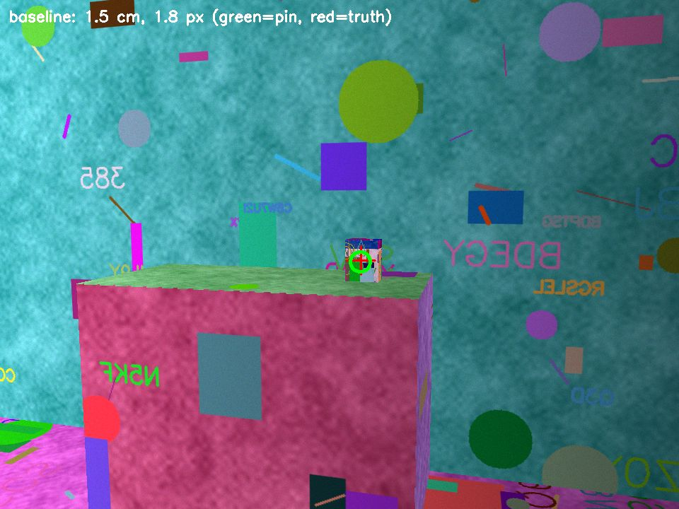
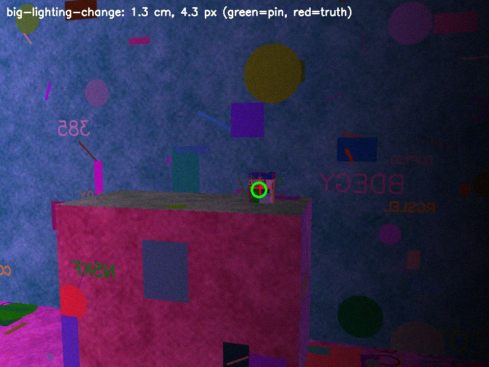
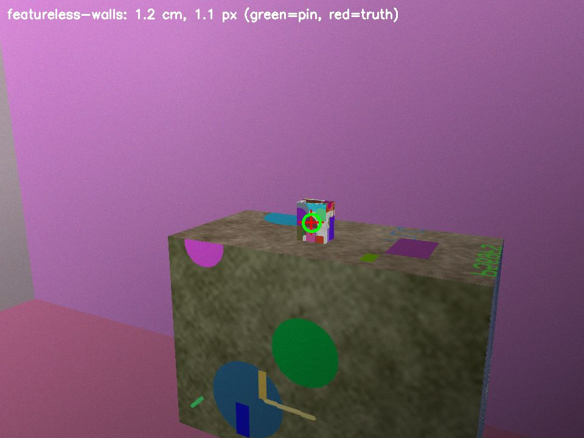
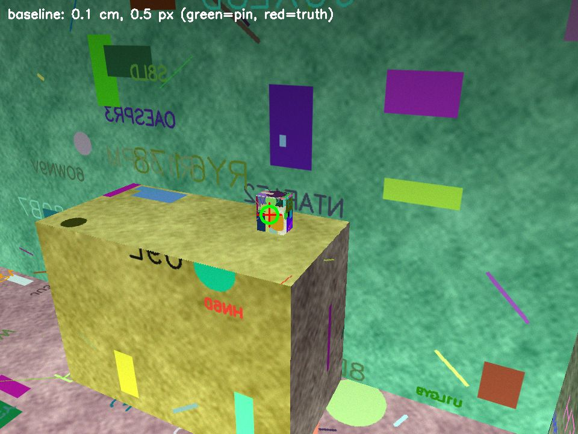

# AR pin simulation

This tool is a headless 3D simulation of the Telly AR medicine pin. It tests the save, relocalize, and project pipeline on Linux, because ARKit does not run in the iOS Simulator.
It is slice D of the AR pin contract and supports the medicine finder in the [plan](../../docs/plan.md#product).

## Run

```sh
uv venv -p 3.12 tools/ar-sim/.venv   # or: python3.12 -m venv tools/ar-sim/.venv
uv pip install -p tools/ar-sim/.venv -r tools/ar-sim/requirements.txt
tools/ar-sim/.venv/bin/python tools/ar-sim/run.py           # 50 baseline trials and 20 trials per failure case
tools/ar-sim/.venv/bin/python tools/ar-sim/run.py --quick   # CI size: 30 baseline trials and 4 per failure case
```

The run prints a metrics table and writes `out/results.json`, `out/results.md`, and marker frames (`out/<case>-<seed>.jpg`).
It exits with 1 when the baseline misses the bar. The `ar-sim` workflow runs `--quick` on the `HEALTH_RUNNER`.
Each trial uses its index as the seed, so two runs with the same pinned versions give the same result.

## What one trial does

1. **Scene.** `render.py` makes a random 5 m x 4 m x 2.6 m room with posters, a cabinet, a sofa, a bookshelf, and a 8 x 12 x 15 cm medicine box on the cabinet. It draws each face with one plane homography and a z-buffer. No GPU is necessary.
2. **Camera.** The camera is iPhone-like: 960 x 720 with fx = 750 px (the ARKit 1920 x 1440 wide camera at half resolution, about 65 degrees horizontal FOV). It adds lighting level, gradient, and colour cast, motion blur up to 6 px, shot and read noise, and auto exposure that amplifies the noise in dim light.
3. **Session 1 (save).** The camera walks an arc around the box (24 frames over 120 degrees). Its VIO poses drift by 1 percent of the distance and 0.05 degrees per frame. ORB features from frame pairs are triangulated into a map. Only points with at least 6 degrees of parallax stay in the map. A tap at the box casts a ray into the map. The anchor goes at the median depth of the map points around the tap, as an ARKit hit test does.
4. **Saved shape.** The map and the anchor go into the app's `ar.pinSaved` reply: anchor id `telly-pin-<containerId>`, and `worldMap` is base64 of a zlib-compressed archive. The trial sends that reply and the `ar.findPin` request through JSON. A baseline map is 160 to 470 KB, well under the 16 MB storage limit.
5. **Session 2 (find).** The camera starts at a different pose with its own origin. The light is 0.6 to 1.4 times the light of session 1, with a gradient and a colour cast. An object covers 15 to 35 percent of every frame. In 12 frames, the camera turns from a random direction toward the box.
6. **Relocalize.** Each frame matches ORB features to the map and solves PnP with RANSAC (`solvePnPRansac`, 3 px), then refines the pose with Levenberg-Marquardt. A frame gives a fix when it has at least 50 inliers. Relocalization counts only when two fixes put the anchor within 5 cm of each other. One fix from far, almost flat points can be confidently wrong. The anchor is the mean of the largest group of fixes that agree.
7. **Project.** The session-2 VIO carries the anchor to the last frame, which looks at the box. The trial measures the 3D error (cm) and the screen error (px) against the true point on the box.

## Results

Full run, 50 baseline trials and 20 trials per failure case:

| case | trials | map saved | relocalized | 3D error cm (median / p95 / max) | screen error px (median / p95 / max) | within 5 cm and 20 px |
|---|---|---|---|---|---|---|
| baseline | 50 | 100% | 96% | 1.00 / 2.16 / 2.79 | 1.8 / 5.4 / 8.6 | 96% |
| short-scan | 20 | 85% | 35% | 1.63 / 3.42 / 3.75 | 1.7 / 5.1 / 6.1 | 35% |
| featureless-walls | 20 | 100% | 70% | 1.17 / 3.90 / 4.32 | 2.5 / 5.6 / 7.1 | 70% |
| big-lighting-change | 20 | 100% | 85% | 1.10 / 2.62 / 2.64 | 2.2 / 5.1 / 7.4 | 85% |
| far-start | 20 | 100% | 95% | 1.47 / 3.25 / 3.70 | 1.8 / 3.9 / 5.1 | 95% |

The bar applies to the baseline: relocalization in at least 90 percent of trials, and the p95 error at most 5 cm and at most 20 px. The baseline passes.
A trial that does not relocalize shows no marker. No trial put a wrong marker on the screen: every relocalized trial, failure cases included, is within 5 cm and 20 px.
The 5 cm bar is the marker error, not a room size: the box is 8 x 12 cm, so the marker must land on it. The `far-start` case starts session 2 3 to 4 m from the box, across the room from it.






Green ring: the projected pin. Red cross: the true point on the box. The files in `evidence/` are copies from `out/` after the full run. They do not show the occluder, so you can see the box.

## Failure cases and app guidance

| Case | Change | Result | Guidance for the app |
|---|---|---|---|
| short-scan | 4 frames over 8 degrees | Few map points; some saves fail and most finds fail | Save only when ARKit reports `.mapped` or `.extending`. If not, show "Move your phone slowly around the box". |
| featureless-walls | Plain walls, floor, and ceiling | Relocalization drops; furniture carries the map | When the find takes too long, show "Point your phone at furniture or objects near the medicine". |
| big-lighting-change | 5 to 10 percent of the light, warm cast, strong gradient | Relocalization drops because of noise | Show "Turn on a light" and keep the save in good light. |

## Limits

- ARKit is not simulated. The sim shows that a saved feature map and anchor relocalize and project correctly, and where that fails. It does not measure Apple's tracker.
- The VIO drift and the camera noise are assumed values, not measured iPhone values. Check one real device (save, close, reopen, find) before you claim device accuracy.
- The room is boxes with procedural textures. Real rooms have more repeated texture, reflections, and moved objects.

## Credits and licenses

No third-party source code is copied or adapted. The flow (save a world map with a named anchor, then load it with `initialWorldMap`) follows the idea of Apple's "Saving and Loading World Data" sample. Dependencies: NumPy (BSD-3-Clause) and OpenCV (Apache-2.0, `opencv-python-headless` wheels MIT), pinned in `requirements.txt`. ORB is Rublee et al., ICCV 2011, as implemented in OpenCV.
