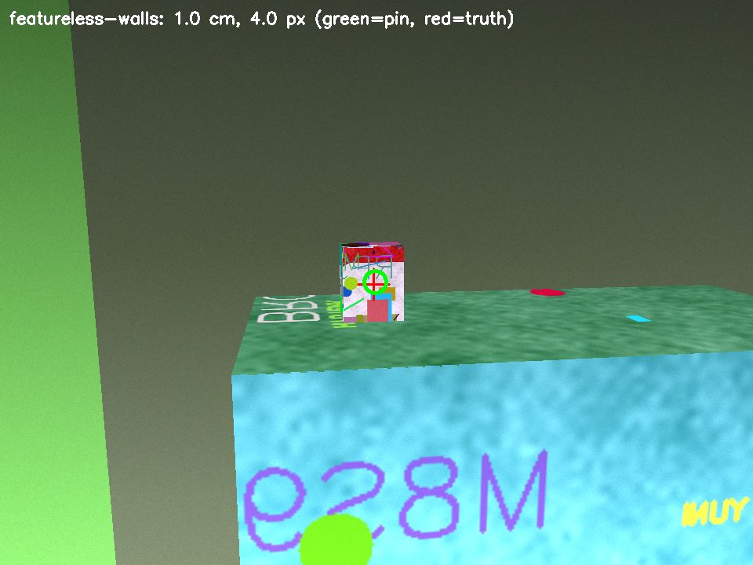
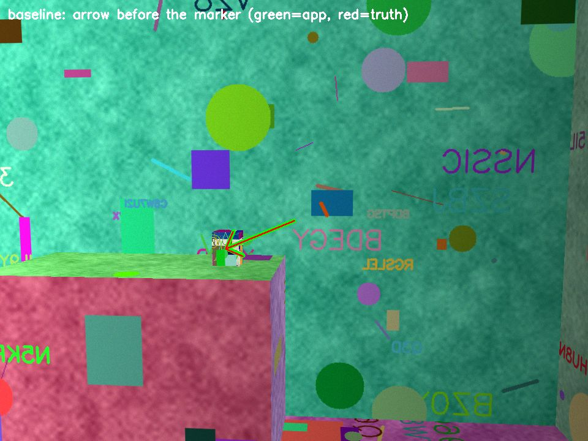

# AR pin simulation

This tool is a headless 3D simulation of the Telly AR medicine pin. It tests the save, relocalize, and project pipeline on Linux, because ARKit does not run in the iOS Simulator.
It is slice D of the AR pin contract and supports the medicine finder in the [plan](../../docs/plan.md#product).

## Run

```sh
uv venv -p 3.12 tools/ar-sim/.venv   # or: python3.12 -m venv tools/ar-sim/.venv
uv pip install -p tools/ar-sim/.venv -r tools/ar-sim/requirements.txt
tools/ar-sim/.venv/bin/python tools/ar-sim/run.py           # 50 baseline trials and 20 trials per failure case
tools/ar-sim/.venv/bin/python tools/ar-sim/run.py --quick   # CI size: 24 baseline trials only (the gate); the full run adds the failure cases
```

The run prints a metrics table and writes `out/results.json`, `out/results.md`, and marker frames (`out/<case>-<seed>.jpg`).
It exits with 1 when the baseline misses the bar. The `ar-sim` workflow runs `--quick` on the `HEALTH_RUNNER`.
Each trial uses its index as the seed, so two runs with the same pinned versions give the same result.

## What one trial does

1. **Scene.** `render.py` makes a random 5 m x 4 m x 2.6 m room with posters, a cabinet, a sofa, a bookshelf, and a 8 x 12 x 15 cm medicine box on the cabinet. It draws each face with one plane homography and a z-buffer. No GPU is necessary.
2. **Camera.** The camera is iPhone-like: 960 x 720 with fx = 750 px (the ARKit 1920 x 1440 wide camera at half resolution, about 65 degrees horizontal FOV). It adds lighting level, gradient, and colour cast, motion blur up to 6 px, shot and read noise, and auto exposure that amplifies the noise in dim light.
3. **Session 1 (save).** The camera walks an arc around the box (24 frames over 120 degrees). Its VIO poses drift by 1 percent of the distance and 0.05 degrees per frame. ORB features from frame pairs are triangulated into a map. Only points with at least 6 degrees of parallax stay in the map. A tap at the box casts a ray into the map. The anchor goes at the median depth of the map points around the tap, as an ARKit hit test does.
4. **Saved shape.** The map and the anchor go into the app's `ar.pinSaved` reply: anchor id `telly-pin-<containerId>`, and `worldMap` is base64 of a zlib-compressed archive. The trial sends that reply and the `ar.findPin` request through JSON. A baseline map is 160 to 470 KB, well under the 16 MB storage limit.
5. **Session 2 (find).** The person starts at a different pose, facing any direction, with a new origin. The light is 0.6 to 1.4 times the light of session 1, with a gradient and a colour cast. An object covers 15 to 35 percent of every frame. The person does only what the app shows, so the path depends on the app's own estimates, not on the true position of the box.
6. **Relocalize.** Each frame matches ORB features to the map and solves PnP with RANSAC (`solvePnPRansac`, 3 px), then refines the pose with Levenberg-Marquardt. A frame gives a fix when it has at least 50 inliers and the inliers spread at least 50 px in every direction. Inliers in a thin strip, such as one shelf edge, let PnP rotate about the strip and give a wrong pose that still fits.
7. **Pairing mode, then arrow, then marker.** Each session-2 frame is in one of three stages:
   - **Pairing mode (no fix yet):** the app has no idea where the box is, so it can only ask for a look around. Pairing must complete before anything else. The app shows "Turn slowly and look around the room", and the person turns on the spot at 15 degrees per frame. After one full turn with no fix, the app shows "Walk closer to where you pinned the medicine and look around". The person walks toward the spot they remember, which is up to about 0.5 m off, and keeps turning. The trial stops counting after 48 frames (two turns). An app does not stop: it keeps pairing mode on.
   - **Arrow:** after the first fix, the app shows an arrow toward its best guess of the anchor. The person turns toward it (up to 30 degrees per frame) and walks toward it. The arrow also shows while the anchor is off screen. The trial measures the angle between the view ray to the app's guess and the view ray to the box.
   - **Marker:** when two fixes put the anchor within 5 cm of each other and the anchor is on screen, the app shows the marker. One fix can be confidently wrong, so the marker waits for a second fix that agrees. The anchor is the mean of the largest group of fixes that agree.
8. **Project.** Ten frames after pairing, the trial measures the 3D error (cm) and the screen error (px) of the marker against the true point on the box.

## Results

Full run, 50 baseline trials and 20 trials per failure case:

| case | trials | map saved | pairing done | pairing turn deg (median / p95) | marker shown | 3D error cm (median / p95 / max) | screen error px (median / p95 / max) | within 5 cm and 20 px | arrow frames | arrow error deg (median / p95) |
|---|---|---|---|---|---|---|---|---|---|---|
| baseline | 50 | 100% | 100% | 90 / 263 | 100% | 1.05 / 2.45 / 3.31 | 3.9 / 10.8 / 14.2 | 100% | 76 | 0.3 / 0.8 |
| short-scan | 20 | 85% | 35% | 345 / 634 | 25% | 1.27 / 2.41 / 2.44 | 2.6 / 4.2 / 4.3 | 25% | 44 | 0.3 / 0.7 |
| featureless-walls | 20 | 100% | 45% | 135 / 498 | 20% | 1.04 / 3.65 / 4.10 | 4.0 / 11.0 / 12.3 | 20% | 66 | 0.2 / 0.7 |
| big-lighting-change | 20 | 100% | 90% | 172 / 409 | 70% | 1.22 / 1.69 / 1.98 | 5.6 / 10.3 / 12.1 | 70% | 67 | 0.4 / 14.8 |
| far-start | 20 | 100% | 90% | 112 / 481 | 90% | 1.32 / 2.72 / 3.17 | 4.4 / 11.2 / 17.4 | 90% | 23 | 0.1 / 1.0 |

The bar applies to the baseline: pairing completes in at least 95 percent of trials, the marker shows in at least 90 percent, the marker p95 error is at most 5 cm and at most 20 px, and the arrow p95 error is at most 15 degrees. The baseline passes.
In the baseline, pairing completed in all 50 trials, after a median turn of 90 degrees. The marker showed in all 50 trials, and every marker was within 5 cm and 20 px.
No trial in any case put a wrong marker on the screen: every marker that showed is within 5 cm and 20 px. When the second fix does not come, the app keeps the arrow and shows no marker.
The 15-degree arrow p95 error in big-lighting-change comes from one dark trial. Its only fix was 15 degrees off, and no second fix came, so the app kept the arrow on and showed no marker.
The 5 cm bar is the marker error, not a room size: the box is 8 x 12 cm, so the marker must land on it. The `far-start` case starts session 2 3 to 4 m from the box, across the room from it.







Green ring: the projected pin. Red cross: the true point on the box. In the arrow frames, the green arrow is the app's arrow and the red arrow is the true direction. When the guess is on screen, the arrow ends at the guess. The files in `evidence/` are copies from `out/` after the full run. They do not show the occluder, so you can see the box.

## Failure cases and app guidance

| Case | Change | Result | Guidance for the app |
|---|---|---|---|
| short-scan | 4 frames over 8 degrees | Few map points. Some saves fail, and pairing often does not complete. | Save only when ARKit reports `.mapped` or `.extending`. If not, show "Move your phone slowly around the box". |
| featureless-walls | Plain walls, floor, and ceiling | Pairing often does not complete; only the furniture carries the map. | During the save, show "Point your phone at furniture or objects near the medicine". |
| big-lighting-change | 5 to 10 percent of the light, warm cast, strong gradient | Pairing drops because of noise. | In pairing mode, show "Turn on a light". Save in good light. |
| far-start | Session 2 starts 3 to 4 m away | Pairing takes longer. It completes more often with more time. | Keep pairing mode on, and show "Walk closer to where you pinned the medicine". |

More time does not help a bad map. With pairing allowed four turns (96 frames) instead of two, far-start pairing completed in 7 of 8 trials. Featureless walls completed in only 2 of 8 trials, and short scans in only 3 of 8. Pairing for those cases is fixed at save time, not at find time.

## Limits

- ARKit is not simulated. The sim shows that a saved feature map and anchor relocalize and project correctly, and where that fails. It does not measure Apple's tracker.
- The VIO drift and the camera noise are assumed values, not measured iPhone values. Check one real device (save, close, reopen, find) before you claim device accuracy.
- The room is boxes with procedural textures. Real rooms have more repeated texture, reflections, and moved objects.

## Credits and licenses

No third-party source code is copied or adapted. The flow (save a world map with a named anchor, then load it with `initialWorldMap`) follows the idea of Apple's "Saving and Loading World Data" sample. Dependencies: NumPy (BSD-3-Clause) and OpenCV (Apache-2.0, `opencv-python-headless` wheels MIT), pinned in `requirements.txt`. ORB is Rublee et al., ICCV 2011, as implemented in OpenCV.
